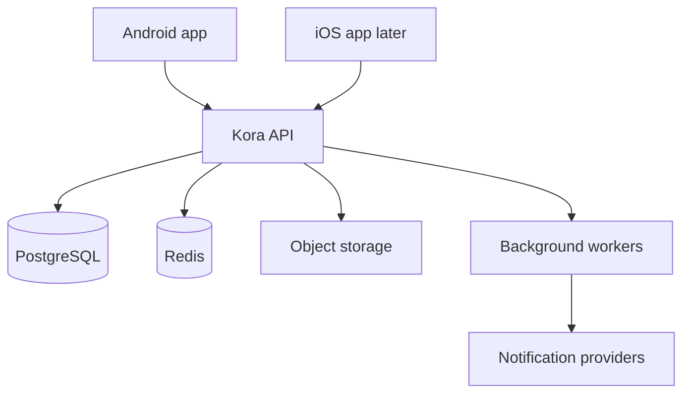
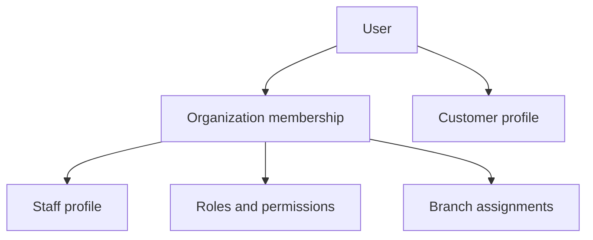
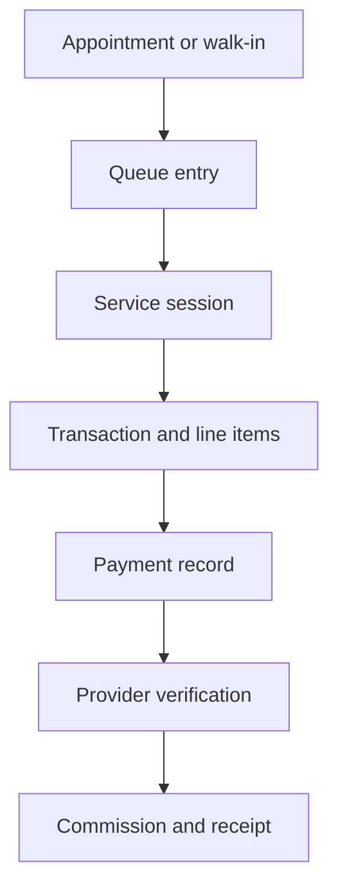
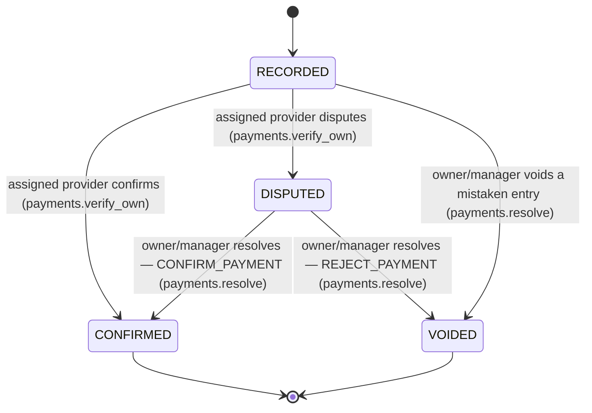

# Kora OS Architecture

Status: Foundation baseline

## 1. Architecture goals

Kora OS must support a single shop with a few employees and grow into a multi-branch service-business platform without replacing its core. The architecture prioritizes financial correctness, tenant isolation, auditability, unreliable-network resilience, clear module boundaries, and mobile usability.

## 2. System context



The Android application is the first production client. iOS will consume the same API and contracts. PostgreSQL is the authoritative store. Room becomes the Android cache and offline queue, not the authoritative source of business or financial truth.

## 3. Repository direction

```text
apps/
  android/              Existing Kotlin and Jetpack Compose application
  api/                  Kora backend modular monolith
  ios/                  Future iOS application
packages/
  contracts/            Generated API schemas and fixtures where useful
docs/                   Product and engineering specifications
infra/                  Deployment definitions added when hosting is selected
```

The existing Google Play `applicationId` remains unchanged so production releases can update the current listing. Internal source namespaces may use the Kora domain naming.

## 4. Mobile architecture

The Android application uses four explicit layers. The first production
integration stage (docs/ROADMAP.md; full detail in section 23) replaced
what had been an entirely local, disconnected demonstration UI with a
real implementation of all four:

### Presentation

- Jetpack Compose screens organized by feature package
  (`feature/auth`, `feature/workspace`, `feature/customer/{home,
  discovery,booking,appointments,profile}`, `feature/business/dashboard`)
  plus a shared `core/designsystem` (buttons, text fields, state views,
  money/date-time formatting) preserving the existing Kora dark/gold
  visual system.
- ViewModels expose one immutable `StateFlow` of screen state each,
  every screen modeling explicit initial/loading/content/empty/
  recoverable-error/authentication-expired states (`ScreenState<T>`),
  and accept user intents as plain method calls.
- Composables contain rendering and interaction wiring only; server
  responses are the only source of truth for anything that decides
  money, availability, or authorization.

### Domain

- No separate use-case layer was introduced beyond what each
  repository already expresses as a single-purpose suspend function —
  the domain surface here is thin enough (booking, discovery,
  appointments, favorites, workspaces, reports) that an additional
  indirection layer would not have reduced risk.
- `DomainError` (`core/network`) is the shared platform-independent
  business-error vocabulary every screen reacts to, mirroring the
  backend's own typed error codes without duplicating backend logic.
- State-transition authority (can this be cancelled, is this slot
  available, what does this cost) is never reimplemented on Android —
  the backend remains the only place any of those questions is
  answered (section 23).

### Data

- `core/data` repositories (`WorkspacesRepository`, `DiscoveryRepository`,
  `AppointmentsRepository`, `FavoritesRepository`, `ReportsRepository`)
  each wrap one Retrofit API interface and return a typed `ApiResult<T>`
  — success or a mapped `DomainError`, never a raw exception.
- Room is not used as an authoritative cache in this stage; automatic
  demo-data seeding was removed entirely. Every screen's data comes
  from a live API call, mapped directly from DTOs into the state each
  ViewModel exposes.
- `core/session` (`TokenStore`, `SessionManager`, `AuthRepository`) is
  the one place session state is read or written; no other layer
  touches a token directly.

### Infrastructure

- `core/network`: Retrofit/OkHttp/Moshi, request-id generation,
  standard envelope/error parsing, an `Authenticator`-based refresh
  pipeline, and debug-only redacted logging (section 23, docs/SECURITY.md
  section 36).
- `core/session`: Keystore-backed encrypted refresh-token storage and
  single-flight refresh coordination (docs/SECURITY.md section 36).
- `core/preferences`: a small DataStore-backed, explicitly
  non-sensitive UX convenience (the last selected workspace) — never an
  access decision on its own.
- `core/location`: on-demand, approximate-only location for "Near you"
  (docs/SECURITY.md section 36).
- `core/di.AppContainer`: explicit, constructor-injection-based manual
  dependency injection — no Hilt, no service locator (section 23).
- Push notifications, telemetry, and background synchronization remain
  unimplemented; this stage is online-only for the screens it covers.

Future shared Kotlin Multiplatform modules may contain domain types, validation helpers, networking contracts, and synchronization rules. The iOS UI decision remains independent until the shared boundary is proven.

## 5. Backend architecture

The backend begins as a modular monolith. It is one deployable service with strong internal boundaries, not a collection of premature microservices.

Initial modules:

- Identity and sessions
- Organizations and memberships
- Branches
- Roles, permissions, and access policy
- Subscriptions and entitlements
- Staff profiles and invitations
- Services and availability
- Customers
- Appointments
- Walk-ins and queue
- Service sessions
- Checkout and transactions
- Payments and verification
- Commissions
- Receipts
- Reconciliation
- Notifications
- Reporting
- Audit

Each module owns its application services and persistence access. Modules communicate through typed application interfaces and domain events rather than reaching into one another's tables from controllers.

## 6. Backend layers

### Transport

- Versioned REST endpoints under `/v1`.
- Authentication, request IDs, validation, rate limits, and consistent errors.
- Controllers translate HTTP requests and do not contain core business logic.

### Application

- Commands and queries implement use cases.
- Authorization is evaluated before protected operations.
- Database transactions define consistency boundaries.
- Idempotency is enforced for replay-sensitive commands.

### Domain

- Entities, value objects, state machines, policy rules, and domain events.
- Financial rules do not import HTTP, database, or notification libraries.

### Infrastructure

- PostgreSQL persistence, Redis coordination, job processing, object storage, delivery providers, and observability adapters.

### Service catalogue, availability, and booking

An organization's bookable `Service` catalogue is grouped by `ServiceCategory` and enabled per branch through `BranchService`, which may override a service's price, duration, or customer-bookability at that one branch — the effective price and duration a customer sees is always server-computed from `Service` plus any `BranchService` override, never client-supplied. `StaffServiceAssignment` connects an eligible, actively branch-assigned staff member to a service at a branch, optionally with its own duration override.

`BranchBusinessHours` (recurring weekly) and `BranchScheduleException` (specific-date closures or special hours, which always win) define when a branch is open; `StaffAvailabilityRule` and `StaffAvailabilityException` define the same for one staff member — deliberately separate tables, because a provider is only bookable where both intersect. `BranchBookingPolicy` centralizes the remaining policy knobs (slot interval, minimum lead time, maximum horizon, buffers before/after, cancellation cutoff, whether a customer may pick a specific provider or only "any available") per branch, with safe hardcoded defaults when a branch has not configured one explicitly.

`AvailabilityEngineService` deterministically combines all of the above — plus already-CONFIRMED appointments — into concrete bookable UTC slots for a requested service (or sequential services), branch, date range, and optional specific provider. Its output is advisory only: nothing about calling it reserves anything, and the actual booking command below revalidates from current state rather than trusting a prior availability read.

Booking (`AppointmentBookingService`) is where a slot becomes a real, durable reservation. Two independent mechanisms make that safe under concurrency:

- **Double-booking prevention is enforced by the database**, not only by the availability screen: a PostgreSQL `EXCLUDE` constraint (`appointments_no_staff_double_booking`, requiring the `btree_gist` extension) on the assigned staff member and the *occupied* UTC time range (service time plus buffers) rejects a genuinely overlapping insert or update outright, so two concurrent requests for the same staff member's same time can never both succeed — whichever transaction commits second gets a database-level conflict, translated into a generic `409 SLOT_UNAVAILABLE`, never a raw constraint error.
- **Idempotency** (`AppointmentIdempotencyKey`, scoped to the authenticated customer and a client-generated key) makes a retried or duplicated booking request return the original appointment instead of creating a second one; reusing a key with a different request is rejected as a conflict.

An appointment's services are stored as `AppointmentItem` snapshots (name, duration, price, currency at booking time) — editing or archiving a `Service` afterward never rewrites a past appointment's record. `Appointment` is not a `ServiceSession`, a `Payment`, or a `Transaction`; a `CONFIRMED` appointment is a reservation, never itself proof that work happened or that revenue was earned (docs/SECURITY.md section 30). `CustomerRecord`, the organization-scoped side of a booking's customer, is created (or reused) automatically on a customer's first booking with that organization and is never visible to, or joinable from, another organization.

### Walk-in intake, live queue, and service sessions

Three domain concepts, kept strict:

- `Appointment` — a reservation (above).
- `QueueEntry` — a customer waiting for or receiving service at a branch *today*. `QueueEntry` itself is the durable walk-in record; a `WALK_IN`-sourced entry and an `APPOINTMENT`-sourced one (created by checking a `CONFIRMED` appointment into the branch's queue, which never mutates the appointment itself) share exactly the same lifecycle, so no separate `WalkIn` table exists.
- `ServiceSession` — actual work performed. A `COMPLETED` session is not a `Payment`, `Transaction`, `Receipt`, or `Commission` — none of those exist yet, and `serviceTotalMinor` is the value of performed services, not proof money was received.

`QueueEntry` moves through an explicit state machine (`WAITING`/`CALLED` ↔ each other or → `CANCELLED`/`NO_SHOW`; either → `IN_SERVICE`). `IN_SERVICE` is reachable only by starting a `ServiceSession`, and `COMPLETED` only by completing one — never a direct command, so a queue entry can never be manually marked done. `BranchQueueDay` (one row per organization, branch, and *branch-local* business date — computed from the branch's own timezone, never the API server's) issues ticket numbers and a polling `revision` through a single atomic Postgres `INSERT ... ON CONFLICT DO UPDATE`, giving Android/iOS a safe polling foundation with no WebSocket or realtime vendor in this phase.

Starting a service (`ServiceSessionsService.start`) is one database transaction: claim the `QueueEntry` (an `UPDATE ... WHERE status IN (WAITING, CALLED)` — the same optimistic, re-checked-on-lock-wait pattern the rest of this codebase uses, not a separate `SELECT ... FOR UPDATE`), resolve and validate the provider (active, tenant- and branch-assigned, qualified for every requested service — the same `resolveEligibleProviders` the availability engine and booking use), snapshot items as `ServiceSessionItem` rows, move the queue entry to `IN_SERVICE`, and write history — all or nothing. Two partial PostgreSQL unique indexes (`WHERE status = 'IN_PROGRESS'`, requiring no additional extension) guarantee at most one active session per staff profile and at most one active session per queue entry at the database level, not only by an application check-then-insert; a violation rolls the whole transaction back, leaving the queue entry exactly as it was, and surfaces as a stable `409 STAFF_ALREADY_SERVING` or `409 QUEUE_ENTRY_ALREADY_IN_SERVICE`, never a raw constraint error. Completion is the same shape: freeze the total, complete the queue entry, one transaction. Cancelling an in-progress session requires a reason and a disposition — `RETURN_TO_QUEUE` (releases the provider, the queue entry goes back to `WAITING`) or `CANCEL_VISIT` (the queue entry is cancelled too) — decided by the acting staff member, never inferred.

A provider may act on their own session (`service_sessions.perform`) but not another provider's without the broader `service_sessions.manage` permission — checked in the service layer, since NestJS's declarative permission guard only expresses "all of these required," not "either of these, then check ownership."

Every transition also appends a `ServiceSessionStatusHistory` row, inside the same transaction as the status-change update — the session's own typed, append-only lifecycle ledger, distinct from the platform-wide `AuditEvent` trail (section 16) both are still written to. `service_sessions.start` is a fourth, narrower permission (receptionist, manager, owner) that reaches `start-service` only — it may start service for a queue entry's *already-assigned* provider, but never complete, cancel, or edit the resulting session, and never redirect the work to a different provider without also holding `queue.manage`. Because `start-service` now legitimately accepts three different permissions with three different scopes (`.start`, `.perform`, `.manage`), the route itself is guarded by a new `@RequireAnyPermission` decorator on `TenantAccessGuard` (section 8) — the coarse "holds at least one of these" gate — while `ServiceSessionsService`'s own `assertStartAuthorized` (a pure, unit-tested function) applies the specific rule each permission actually carries once past it.

## 7. Identity and session architecture

`User` is the global Kora identity. `OrganizationMembership` connects a user to a business. `StaffProfile` contains employment information within that organization. `CustomerProfile` is the same user acting as a customer — the customer workspace and the business workspace (docs/PRODUCT_REQUIREMENTS.md section 2) share one identity without either being authoritative over the other.



Kora OS uses passwordless email OTP authentication for customers, owners, managers and staff. Kora does not store or support user passwords. A user signs in by requesting a one-time code by email and submitting it back — the same flow for a first sign-up and every later sign-in. `AuthIdentity` maps a user to a provider (`EMAIL_OTP` today; `GOOGLE`, `APPLE`, `PHONE_OTP`, and `EMAIL_MAGIC_LINK` are reserved for later) without ever holding a persisted password credential — an OTP challenge is short-lived and lives in its own table, not on the identity or the user. Access tokens are short-lived and carry no role or permission claims. Refresh credentials rotate on every use, are revocable per device, and reusing an already-rotated one revokes the whole session. Mobile secrets use operating-system secure storage. OTP codes are stored only as a keyed digest and never appear in logs.

## 8. Tenant isolation and authorization

Every tenant-owned record carries `organizationId`. The active organization is derived from authenticated membership and explicit request context, never trusted from an arbitrary request body alone.

Authorization evaluates:

1. Authenticated user.
2. Active organization membership.
3. Membership status.
4. Subscription access mode and entitlement where relevant.
5. Required permission — every named code (`@RequirePermissions`, AND semantics).
6. Any-of permission — at least one named code (`@RequireAnyPermission`, OR semantics), for a route more than one permission legitimately reaches with different downstream scope (e.g. `ServiceSessionsController`'s `start-service`).
7. Branch scope.
8. Resource ownership and current state.

Database queries include organization scope. Unique constraints that represent business uniqueness include `organizationId` when appropriate. Automated tests attempt cross-tenant reads and mutations for every sensitive module.

## 9. Subscription and entitlement architecture

Subscriptions belong to organizations. A plan supplies entitlements; the subscription supplies lifecycle state and billing period.

Core concepts:

- Plan
- Plan price
- Entitlement definition
- Plan entitlement
- Organization subscription
- Subscription event
- Billing customer reference
- Usage counter

The API derives an effective access mode:

- `FULL`: trialing, active, or permitted grace period.
- `LIMITED`: past due with selected administrative actions available.
- `READ_ONLY`: operational data remains viewable but new commercial activity is blocked.
- `BLOCKED`: only account recovery, billing, export, and support actions remain.

Provider-specific IDs and payloads stay in the billing adapter. Webhooks are signature-verified, idempotent, stored for reconciliation, and translated into internal subscription events.

## 10. Operational lifecycle

`Appointment`, `QueueEntry`, `ServiceSession`, `Transaction`, and `Payment` are separate aggregates with explicit links.



The transaction stores captured line-item descriptions and prices so historical receipts remain stable after catalog edits.

## 11. Financial consistency

Implemented (docs/ROADMAP.md Phase 6): four distinct entities, each proving a different fact, deliberately never collapsed into one:

- **Checkout** — the amount due for one completed ServiceSession. Immutable snapshots (`CheckoutLineItem`) of what was actually performed, never a live join back to the current Service catalogue.
- **PaymentRecord** — a staff member's *claim* that money was received against a Checkout. Recording one is not itself revenue.
- **PaymentDispute** / `PaymentVerificationEvent` — the assigned provider's confirm-or-dispute step every claim must pass, and an owner/manager's resolution of a dispute.
- **Transaction** — the immutable, posted commercial fact. The only thing a future reporting phase may ever count as business revenue. Created exactly once per Checkout, only when confirmed `PaymentRecord` applied amounts exactly equal the Checkout total, atomically inside the same database transaction that confirms or resolves the final required payment.

Money is stored as integer minor units plus a 3-letter ISO currency code throughout, with explicit overflow validation against PostgreSQL's 32-bit `Int` column ceiling (never floating point). Checkout creation and payment recording both accept a client-generated `Idempotency-Key`, scoped by organization, membership, operation, and idempotency key, storing the request fingerprint and the resulting resource; reusing a key with a different request body is rejected (`IDEMPOTENCY_CONFLICT`), and replaying the same key/body returns the original result rather than a duplicate. Every payment-domain mutation (record, confirm, dispute, void, resolve) takes a `SELECT ... FOR UPDATE` row lock on the parent Checkout as its first database action, in the same order every time — this single lock is what serializes every concurrent mutation against one Checkout and is what makes "exactly one Transaction is ever posted per Checkout, even under concurrent confirmations" true, without any additional locking primitive. Financial transitions execute inside database transactions; a failed transition leaves every row — Checkout, PaymentRecord, Transaction, and their line items/allocations — exactly as it was before the attempt.

Refunds, reversals, commissions, receipts, and reconciliation are explicitly deferred to a later phase (docs/ROADMAP.md Phase 7) and do not exist yet — a Checkout may currently only be voided (before settlement) or posted as a Transaction (after settlement), never reversed once posted.

## 12. Verification state machine

Implemented as `PaymentRecordStatus` (RECORDED → CONFIRMED | DISPUTED; DISPUTED → CONFIRMED | VOIDED via resolution; CONFIRMED and VOIDED are terminal):



Every accepted transition writes an append-only `PaymentVerificationEvent` (previous status, new status, actor, reason where applicable) and an `AuditEvent`, both inside the same database transaction as the state change itself. Separation of duties is enforced in code, not only by permission: a recorder who is also the assigned provider cannot confirm their own claim (`PAYMENT_SELF_CONFIRMATION_FORBIDDEN`) — the one exception is a solo owner/provider, who may confirm via `payments.resolve` as an explicitly reasoned, separately audited (`payment.management_override`) management override, since no independent third party exists to confirm on their behalf. Commission finalization (a future phase) is intended to require a confirmed outcome, mirroring this same principle.

## 13. Events and background work

Business state and an outbox event are written in the same database transaction. A worker publishes unprocessed outbox events to notification, reporting, receipt, and realtime handlers.

Important events include:

- AppointmentCreated
- CustomerCheckedIn
- ServiceStarted
- ServiceCompleted
- PaymentRecorded
- PaymentConfirmationRequested
- PaymentConfirmed
- PaymentDisputed
- DisputeResolved
- CommissionFinalized
- ReceiptIssued
- SubscriptionStateChanged

Handlers are idempotent. A failed notification does not roll back a valid financial transaction.

## 14. Offline and synchronization architecture

The Android app may cache services, customers, appointments, queue state, and authorized summaries. Locally created commands carry a stable command ID, organization, branch, device, local timestamp, schema version, and sync status.

Sync statuses are:

- Pending
- Sending
- Synchronized
- Failed retryable
- Rejected
- Conflict

Financial offline commands are introduced only after their duplicate, conflict, authorization, and recovery behavior is tested. The app never converts an uncertain network result into a second payment attempt with a new idempotency key.

## 15. Notifications and realtime updates

Business modules publish internal events. Notification policies decide recipients and channels. Channel adapters deliver push, in-app, SMS, WhatsApp, or email.

Realtime updates improve dashboards and queues but are not the source of truth. After reconnecting, clients refresh authoritative API data using version or cursor information.

## 16. Audit and observability

Audit events are append-only from application code and separate from diagnostic logs. They include organization, optional branch, actor, action, entity, request ID, timestamp, safe before/after metadata, and source device where known.

Operational telemetry includes structured logs, metrics, traces, job status, notification delivery status, request IDs, and error monitoring. Logs redact tokens, OTP codes, payment credentials, and sensitive customer content — Kora has no passwords to redact, since it does not store or support them.

## 17. Security boundaries

- The mobile app never contains backend, billing, or payment-provider secrets.
- TLS protects all production traffic.
- Input validation occurs at transport and domain boundaries.
- Rate limits protect authentication, invitations, booking, and financial routes.
- Database backups are encrypted and restoration is tested.
- Administrative support access is explicit, time-bounded, and audited.

## 18. Deployment direction

Initial production deployment consists of:

- One stateless API service with multiple instances when needed.
- One worker process using the same application modules.
- Managed PostgreSQL with backups and point-in-time recovery.
- Managed Redis for bounded caching, jobs, and coordination.
- S3-compatible object storage for receipts and future attachments.
- Separate development, staging, and production environments.

## 19. Architectural decisions

- Use a modular monolith before microservices.
- Keep PostgreSQL as the source of truth and Room as a client cache.
- Use organization-scoped RBAC with branch constraints.
- Keep subscriptions provider-neutral and server-enforced.
- Keep appointments, service sessions, transactions, and payments separate.
- Use minor currency units and idempotent financial commands.
- Use transactional outbox events for reliable side effects.
- Generate mobile API models from versioned contracts where practical.
- Introduce Kotlin Multiplatform sharing incrementally instead of rewriting the working Android UI immediately.

## 20. Architecture guardrails

- No business logic in Composables or HTTP controllers.
- No direct database access across module boundaries without an owned interface.
- No tenant-owned query without organization scope.
- No financial state transition without authorization, idempotency, database transaction, and audit evidence.
- No notification-provider calls inside core transaction logic.
- No production feature considered complete while backed only by local demonstration data.
- No unrestricted database access for AI/business-intelligence features (post-V1 extensions, docs/ROADMAP.md section 17): any future AI layer consumes the same controlled, authorized discovery and availability APIs a client would, never a direct query path.

## 21. Commission, receipt, and reporting architecture

Implemented (docs/ROADMAP.md Phase 7): the next stage after a Transaction posts. `CommissionAccrualService` and `ReceiptService` are invoked from inside `TransactionPostingService.postForCheckout` — the same database transaction that creates the Transaction itself — so the full chain (`Payment verification/resolution -> POSTED Transaction -> CommissionAccrual rows -> Receipt`) either commits together or rolls back together entirely; no partial state is ever observable. Both services check for their own already-created rows first, so the identical call also serves as `TransactionPostingService.ensureDerivedRecords`' internal repair path (never exposed through any route) with no separate code to keep in sync.

**Commission rules are versioned, never mutated in place.** A `CommissionRule` is scoped independently across up to three optional dimensions — branch, staff, service — and resolved by an eight-level deterministic precedence (most specific combination of staff+branch+service down to the bare organization default) implemented as a pure function, `selectMostSpecificRule`. Changing a rule always either supersedes it (closing the old row and creating a new one at the identical instant, `supersedesRuleId` linking them) or explicitly deactivates it; only one *current* rule may exist per exact scope, enforced by a partial `UNIQUE ... NULLS NOT DISTINCT` index at the database level (docs/DATA_MODEL.md section 9). A rule is resolved as of the Transaction's own `postedAt` — not "now" — so a later rule change never retroactively touches an already-created accrual, which snapshots every value (rule type, rate, fixed amount, basis, basis amount, calculated amount) it depended on.

**Calculation is exact-integer throughout.** `roundHalfUpDivision` uses `BigInt` and the identity `floor((2n+d)/(2d))` to round a percentage commission to the nearest minor unit with no floating-point step. `NET_LINE_AFTER_ADJUSTMENTS` basis allocates a Checkout's signed adjustment total across every line item by the largest-remainder (Hamilton apportionment) method, `allocateAdjustmentsAcrossLines` — floor each line's exact share, then distribute the small integer remainder to the lines with the largest fractional remainders (ties broken by `displayOrder`), which guarantees the allocated amounts sum to *exactly* the Transaction's net total, for either a positive or negative adjustment. A rule with no match, or an explicit `NONE`-type rule, produces a `calculatedAmountMinor` of exactly 0 — never a missing accrual (`source: NO_POLICY` vs `POLICY`, docs/DATA_MODEL.md section 9) — because missing policy must never block a legitimate Transaction from posting.

**Receipt numbering reuses the queue-ticket pattern.** `BranchReceiptSequence` is a per-(branch, branch-local calendar year) atomic counter via one native `INSERT ... ON CONFLICT DO UPDATE`, the same mechanism `BranchQueueDay`/`allocateQueueTicket` already established — no read-then-write step for a concurrent second caller to race against. The formatted number (`{branchCode}-{year}-{sequence}`) carries no UUID, PII, or credential, and its uniqueness is scoped to the organization, not the whole platform (docs/DATA_MODEL.md section 9's `receipts` entry explains why a global constraint would be wrong).

**Reporting reads only already-immutable records.** Every figure on `GET .../reports/*` is derived from a POSTED `Transaction`, its `TransactionLineItem` snapshots, its `CommissionAccrual` rows, or the `ReceiptPaymentSummary` snapshots taken at issuance — never a live `PaymentRecord` (a claim, not revenue) and never a mutable `Service` price. A RECORDED or DISPUTED payment claim surfaces only as an explicitly separate, never-summed-into-revenue operational counter on the overview report (`pendingPaymentClaimCount`/`disputedPaymentClaimCount`). Every monetary total is kept strictly separated by currency (`sumByCurrency`/`summarizeByCurrency` never combine two currencies into one number) and every date-range query is capped at 366 days. A branch-scoped report groups by that branch's own local calendar day; an organization-wide report spanning potentially many branch timezones requires an explicit, IANA-validated `timezone` query parameter rather than silently picking one branch's zone or mixing ambiguous local-day boundaries.

Refunds, reversals, and cash-session reconciliation are implemented in section 22 below. Payouts and any "paid"/settlement status for a commission remain explicitly out of scope.

## 22. Cash controls, refund/reversal corrections, and gross/net reporting

Implemented (docs/ROADMAP.md Phase 7): the stage after commissions, receipts, and reports. Two mostly-independent additions share one theme — a posted `Transaction` and a cash drawer are each given a safe way to be *corrected* after the fact without ever mutating an immutable record.

**Branch cash controls are a physical-custody model, never a revenue model.** A `BranchCashPolicy` (OPTIONAL by default — every branch that never configures one behaves exactly as before this stage existed; or REQUIRED) governs whether recording a CASH `PaymentRecord` or executing a CASH refund needs an open `CashSession` on a named `CashRegister`. At most one OPEN `CashSession` may exist per `(registerId, currency)` at a time — a partial unique index (`WHERE status = 'OPEN'`, the same "Prisma's schema DSL has no stable declarative support for this" pattern `commission_rules`' `NULLS NOT DISTINCT` index already established), proven under five concurrent open attempts converging on exactly one row. Every `CashLedgerEntry` is append-only, carries a strictly positive `amountMinor`, and its `type` (OPENING_FLOAT/PAYMENT_RECEIVED/CASH_IN/CASH_OUT/SAFE_DROP/REFUND_PAID) alone determines its direction in the expected-cash formula — never a signed column. `CashSessionsService.lockCashSession` takes a `SELECT ... FOR UPDATE` on the target session before every mutation, the same aggregate-root-lock pattern `CheckoutSettlementService` established in section 11; a `BEFORE INSERT` trigger on `cash_ledger_entries` (`reject_cash_ledger_entry_on_non_open_session`) is a hard database-level backstop behind that lock, taking its own row lock on the session inside the trigger body so it stays race-safe against a concurrent close, confirmed against a real PostgreSQL instance by directly attempting the insert with the application layer bypassed entirely. `expectedClosingCashMinor` (opening float + cash payments recorded into the session + manual cash in − manual cash out − safe drops − executed cash refunds) is calculated once, at close, from the session's own immutable ledger entries — closing transitions OPEN → CLOSED exactly once and can never be reopened or recomputed; a `CashSessionReview` (MATCHED/ACCEPTED_VARIANCE/INVESTIGATION_REQUIRED) moves CLOSED → REVIEWED without ever touching the original snapshot. Recording a CASH `PaymentRecord` with a supplied `cashSessionId` creates its `PAYMENT_RECEIVED` ledger entry atomically alongside the `PaymentRecord` itself, inside the same database transaction that already holds the Checkout lock — `CashSessionsService.recordPaymentReceivedEntry` takes the CashSession lock *second*, preserving one global lock order (Checkout, then CashSession) everywhere in the codebase with no deadlock risk.

**A `TransactionCorrection` is the only path that ever posts a REFUND or REVERSAL Transaction — the original SALE Transaction is never mutated or deleted.** `Transaction.kind` (SALE/REFUND/REVERSAL, existing rows migrated to SALE) determines the sign of every `*Minor` value at the reporting layer only — the stored value is always a non-negative magnitude, exactly like every other money column in this codebase, and `correctedTransactionId` (self-referencing, nullable) links a corrective Transaction back to the SALE it corrects. A REFUND requests specific original line items and minor-unit amounts — never a client-supplied price, currency, or total — and multiple partial refunds are allowed as long as the cumulative amount per line never exceeds that line's own original amount; a REVERSAL fully negates every original line at once and is blocked once any refund or reversal has already been executed against that sale, and once any reversal succeeds no further correction against that sale is possible. The workflow is a state machine — REQUESTED → APPROVED/REJECTED/CANCELLED, APPROVED → EXECUTED/CANCELLED, every other state terminal — with separation of duties enforced by `assertCorrectionDecisionAuthorized` (a pure, unit-tested function mirroring `assertConfirmAuthorized` from section 12): the requester can never approve or reject their own request, except a solo owner with no other eligible approver in the organization at all, who may do so only with an explicit, separately audited override reason.

**Execution is one atomic transaction locking the original sale as its aggregate root.** `TransactionCorrectionExecutionService.execute` locks the `TransactionCorrection` row, then locks the *original* SALE `Transaction` row — a higher-level aggregate root than the correction itself — before ever recalculating what remains refundable, so every concurrent execution attempt against the same sale (a retry of this exact correction, or a different correction against the same sale) serializes on that one lock; remaining-refundable amounts are always recalculated fresh from other corrections' own immutable EXECUTED records, never from anything computed before the lock was acquired. Inside that lock, execution creates the corrective Transaction (immutable line-item snapshots referencing the original line items), the corrective `CommissionAccrual` rows (via `CommissionAdjustmentService`, described below), the corrective `Receipt` (via `ReceiptService.issueCorrectiveReceipt`), and — when returned in cash with a supplied session — exactly one `REFUND_PAID` `CashLedgerEntry`, then marks the correction EXECUTED: all or nothing, the same shape as posting a Transaction in section 11. An idempotency key is required to execute (and to request); a genuine retry with the same key replays the original result even after the correction has already moved past APPROVED, since the idempotent-replay check runs *before* the state-validity check, not after — the same ordering `PaymentsService.record` already establishes. Five concurrent execute attempts against the same approved correction produce exactly one corrective Transaction and four `409` conflicts; a failed execution (e.g. exceeding the remaining refundable) leaves no corrective Transaction, receipt, or commission adjustment behind.

**Commission adjustments are calculated only from the original EARNED accrual's own immutable snapshot — never the current `CommissionRule`, even if it has since changed or been deactivated.** `CommissionAccrual.kind` (EARNED/REFUNDED/REVERSED) and `originalAccrualId` (self-referencing) extend the existing model from section 21 without touching it: a correction never updates or deletes the original accrual. For a PERCENTAGE rule, `calculatePercentageAdjustmentBasis` derives the refunded *basis* (the original accrual's own snapshotted basis amount, prorated by refunded/original line amount using exact `BigInt` half-up rounding — the same `roundHalfUpDivision` primitive section 21 already established), then the adjustment is recomputed from that shrunk basis using the original snapshotted rate, capped at whatever remains of the original accrual. For a FIXED rule, a full-line correction always reverses exactly the remaining balance (bypassing proration entirely, so a full reversal can never be left short by a rounding residue); a partial correction prorates the original *calculated amount*, still capped at what remains — cumulative adjustments across any number of partial corrections can therefore never exceed the original accrual regardless of calling order. A NONE or NO_POLICY original accrual always produces an explicit zero-value adjustment row, mirroring section 21's "a missing policy must never block a legitimate posting" principle for corrections too.

**A corrective Receipt is issued through the identical atomic sequence as a sale receipt, extended with a `kind` discriminator.** `ReceiptKind` (SALE_RECEIPT/REFUND_RECEIPT/REVERSAL_RECORD) and `originalReceiptId` (self-referencing) extend the model from section 21; a corrective receipt additionally snapshots the correction reason, the returned amount and method, and — for a REFUND — the remaining refundable balance. It is never called a statutory tax invoice or credit note, matching section 21's existing "not a VAT invoice" stance for the original receipt kind.

**Reporting adds an explicit gross/net split without redefining any existing field.** `netByCurrency` (gross minus every deduction list, per currency) and `summarizeTransactionKinds` (SALE/REFUND/REVERSAL totals and counts) are the two new pure primitives every report endpoint's totals are built from. `postedRevenue`, `revenue`, `commissionAccrued`, `total`, and `policyAccrued` all keep their original gross-SALE-only (or EARNED-only) meaning exactly as before this stage; new fields (`grossPostedSales`/`refundAmount`/`reversalAmount`/`netPostedRevenue` on the overview, and `refundedRevenue`/`reversedRevenue`/`netRevenue`/`commissionRefunded`/`commissionReversed`/`netCommission`/`refundedAmount`/`netAmount`/`returnedTotal`/`netTotal`/`refunded`/`reversed`/`net` across the others) sit alongside them. A new `GET .../reports/cash-reconciliation` surfaces each session's own opening float, payment received, manual cash in/out, safe drops, cash refunds, expected closing cash, counted cash, and variance — described only as physical cash custody, never as revenue or bank settlement, and never derived from a live `PaymentRecord` or `CashLedgerEntry` read outside that one session's own immutable rows.

Payment-gateway integration, external settlement matching, payouts, commission "paid"/settlement status, subscription billing, statutory tax invoicing, and receipt PDF/email delivery remain explicitly out of scope for this stage.

## 23. Android application architecture and secure session management

Implemented (docs/ROADMAP.md): the first stage that makes Android call
the real API at all, covering email-OTP sign-in through session
restoration, workspace selection, customer discovery/booking/appointment
management, and an initial permission-gated business dashboard. The old
Google-AI-Studio-origin app — a single-Activity, fully local, Room-backed
POS simulation with zero networking and zero authentication — was
classified item by item: the Kora visual system (`ui/theme`) and the
official logo were kept unchanged; every business-logic screen, dialog,
ViewModel, repository, and Room entity was replaced, since all of it
represented either explicitly-deferred business operations (queue,
checkout, payments, commissions) or hardcoded demonstration data
("Urban Crown Salon", `Double`-based commission math) with no connection
to the real backend.

**Manual, constructor-injection dependency injection — no Hilt, no
service locator.** `core/di.AppContainer` is a single class built once
in `KoraApplication.onCreate()` and threaded down to `KoraNavHost`.
Hilt was deliberately not adopted: it would add a new annotation-
processing toolchain surface to a project that never used it, for a
dependency graph small enough that plain constructor injection is
sufficient and fully testable without it (every ViewModel test in this
stage constructs its subject directly against fakes, with no DI
framework involved at all). `AppContainer` resolves one circular
dependency — `SessionManager` needs `AuthApi`, and the main OkHttp
client's `Authenticator` needs `SessionManager` — by building two
separate Retrofit/OkHttp clients: an auth-only client (request-id and
debug-logging interceptors only, no `AuthInterceptor`/`Authenticator`)
used solely to construct `AuthApi` and, from it, `SessionManager`; then
the main client (adds `AuthInterceptor` and `TokenAuthenticator`, both
depending on that now-constructed `SessionManager`) used for every other
API interface.

**Every screen models the same explicit state set.** `ScreenState<T>`
(`Initial`, `Loading`, `Content`, `Empty`, `Error(DomainError)`,
`AuthenticationExpired`) is the one shared vocabulary every feature
ViewModel's `StateFlow` uses, so a Compose screen never has to guess
whether an absent value means "still loading" or "loaded and empty."

**The standard API envelope and every documented error code map to a
closed, typed Kotlin vocabulary — never a raw exception reaching a
screen.** `safeApiCall` wraps every Retrofit suspend call, parses a
non-2xx body as the standard error envelope (docs/API_SPEC.md section
5), and maps it to one of exactly the `DomainError` cases the product
task specified (validation, unauthorized, forbidden, subscription
read-only/blocked, rate-limited, not-found, conflict, slot-unavailable,
server/network-unavailable, unknown-safe) — `SLOT_UNAVAILABLE` and a
generic `409` are distinguished by error code, not just HTTP status,
and `IOException` is mapped to network-unavailable rather than any
generic failure. `CancellationException` is always rethrown, never
swallowed, so cancelling a superseded coroutine (the discovery-search
case below) never gets mistaken for a failed API call.

**Refresh rotation is single-flight and safe under concurrent 401s.**
`TokenAuthenticator` (an OkHttp `Authenticator`) calls
`SessionManager.refreshIfNeeded(failedAccessToken)` through a
`RefreshCoordinator` seam, which acquires a `Mutex` and checks whether
the in-memory access token has already changed since the caller's
request failed — if so, another caller already refreshed while this one
waited, and the already-updated token is reused with no second network
call. A definitive rejection (invalid, expired, or reused refresh
token) clears local session state immediately; a transient failure
(network/server unavailable) leaves the stored refresh token intact,
distinguished via the same `DomainError` vocabulary above rather than
by re-parsing an HTTP status a second time. The authenticator itself
refuses a second retry of the same request and never intercepts the
`auth/*` endpoints, so a failing refresh call can never trigger another
refresh (docs/SECURITY.md section 36 has the full security framing).

**A real architectural bug was caught and fixed before ever compiling
against it: a `null`-valued "no workspace selected" preference could
not be told apart from an explicit "chose Customer" selection.**
`LocalPreferences.selectedWorkspace` is a `SelectedWorkspacePreference`
sealed type (`NeverChosen`/`Customer`/`Organization(id)`) backed by one
DataStore string key with a sentinel value for "Customer," rather than
a nullable `String?` that would have conflated the two states.

**A second real bug was caught before runtime: a value stored on a
`NavBackStackEntry.savedStateHandle` does not survive an inclusive
`popUpTo` of the entry that set it.** The original design meant to pass
`organizationId` from the splash screen into the business-workspace
graph via `savedStateHandle`, then call
`navigate(...) { popUpTo(SPLASH, inclusive = true) }` — but that pop
destroys the very entry the value was stored on before the destination
route reads it back. The fix makes the organization id part of the
business graph's own route pattern
(`KoraRoutes.BUSINESS_GRAPH_PATTERN = "business/{organizationId}"`,
matching a `navArgument`), so it survives any `popUpTo` regardless of
which entry gets removed.

**Workspace routing revalidates against the live server on every
decision, never a cached list.** `decideInitialWorkspaceRoute` is a
pure function over a freshly fetched `GET /v1/me/workspaces` response:
no memberships plus customer available → customer home; exactly one
business membership with customer unavailable → straight to that
business; anything else (customer plus any business, multiple
businesses, or neither available) → the chooser. `resolveAndNavigate`
(the only caller) checks a locally remembered selection against that
same fresh list and clears it if it is no longer valid before ever
applying the pure decision function — a stale local selection can never
substitute for a live membership check (docs/SECURITY.md section 36).

**Discovery search is debounced and genuinely cancels stale work, not
merely races it.** `DiscoveryViewModel` combines query/category/
location `StateFlow`s, applies `debounce(300ms)` and
`distinctUntilChanged()`, and collects with `collectLatest` — a query
change arriving while a previous search is still awaiting its network
response cancels that in-flight coroutine outright, verified directly
by holding a fake API call open and proving it never reaches its
completion branch once superseded, rather than only checking that the
final UI state happens to look right.

**Booking's idempotency key is generated once per attempt and reused
across retries — never regenerated per HTTP call.**
`BookingViewModel` derives a stable snapshot key from
`serviceId|staffProfileId|slot.startAt|slot.staffProfileId`; a `UUID` is
generated only the first time that snapshot is submitted, or when the
snapshot itself changes (a different slot was picked), and is cleared
only on a terminal outcome — a successful booking, or a
`SLOT_UNAVAILABLE` conflict, which also forces availability to reload
and returns the wizard to the time-selection step. Any other failure
(network, server, validation) keeps the same key so a client-driven
retry safely replays the identical request. A submission already in
flight is rejected outright (`isSubmitting` guard), preventing a
duplicate tap from ever reaching the network twice.

**Money and time follow the backend's own authoritative shape,
never a client-side reinterpretation.** `MoneyFormatter` operates only
on the integer minor-unit amount and ISO currency code the API returns,
looking up fraction digits from `java.util.Currency` rather than
assuming two decimal places; `KoraDateTimeFormatter` converts a UTC ISO
instant into the branch's own IANA time zone (never the phone's),
verified directly across a DST-active and a DST-inactive date for the
same zone. Core library desugaring is enabled specifically so
`java.time` is available back to `minSdk = 24`.

**Reschedule does not need a discovery-availability slug at all.** The
authenticated `AppointmentDto` the customer already holds carries no
business slug, so re-running the full discovery-based availability
picker for a reschedule was not directly constructible from an
appointment alone. Since the reschedule endpoint is itself the sole
authority on whether a new time is actually available (the client must
never precompute that — docs/API_SPEC.md section 15), the reschedule
flow uses native date/time pickers interpreted in the appointment's own
`branchTimeZone`, converts to a UTC instant, and lets the server accept
or reject it — no client-side availability pre-check is needed or
attempted.

**Testing exercises real collaborators through fakes at the Retrofit-
interface seam, never mocks of this app's own classes.** Unit and
Compose UI tests (JVM, via Robolectric where an Android context is
needed) construct real `SessionManager`/`AuthRepository`/*Repository*
instances against hand-written fakes of the Retrofit API interfaces —
proving the actual envelope-parsing, refresh-coordination, and
booking-key logic runs, not a mocked stand-in for it. One deliberate
exception is documented directly in the test suite:
`EncryptedSharedPreferences`/Android Keystore has no working provider
inside a plain-JVM Robolectric process (confirmed directly —
`KeyStoreException: AndroidKeyStore not found`), so `TokenStore`
accepts a test-only `prefsProvider` seam that substitutes a plain
`SharedPreferences` to verify its own field-mapping logic, while a
dedicated test using the real default factory confirms the "Keystore
unavailable" path fails safe exactly as designed rather than crashing —
the true hardware-backed encrypted round trip is left to a connected/
instrumented test on a real device or emulator, which this stage did
not have available (no `adb` device was connected; per this stage's own
constraints, no emulator was created without approval).

## 24. Business onboarding, staff invitations, and the invite deep link

Implemented (docs/ROADMAP.md): a second Android vertical slice covering
business owner onboarding, post-onboarding business management, and the
full staff-invitation lifecycle including deep-link acceptance. Unlike
section 23's stage, this one *did* have an existing AVD available and
was verified against a running backend on it (Phase 11 of the task).

**Organization creation is idempotent end to end, mirroring the
booking-key pattern from section 23.** `OrganizationsApi.create` takes
a required `Idempotency-Key` header; `OnboardingViewModel` computes a
stable key from the submitted request's own snapshot, generating a new
`UUID` only when that snapshot changes, and clearing it only on the one
terminal failure that means the previous attempt is unrecoverable as
submitted (`409 ORGANIZATION_SLUG_TAKEN`) — any other failure keeps the
same key so a retry safely replays. The backend's own
`OnboardingService` enforces this server-side with a pre-check plus a
reactive unique-constraint catch inside the same transaction
(docs/SECURITY.md section 37).

**Resumability is revalidated against the server on every reopen, not
trusted from local state.** `OnboardingViewModel.resume()` reads only
an organization *id* from `LocalPreferences` (never progress or
content), then re-derives everything else — organization name, setup
status, and which step to land on — from
`GET .../setup-status` and `GET .../branches`, the same
revalidate-against-a-fresh-fetch discipline section 23 established for
workspace routing. A resumed session whose remembered organization is
no longer reachable (deleted, access revoked) falls back to starting
fresh rather than getting stuck.

**A real bug found only by resuming a session on a real device: the
primary branch id was never re-resolved on resume.**
`GET /v1/organizations/:organizationId` carries no branch data (branch
CRUD is out of scope this stage — see below), so before this fix,
reopening an in-progress or completed setup left
`OnboardingUiState.primaryBranchId == null`, which made
`saveHours()` silently return with no error and no network call, and
made a staff invitation sent afterward carry no branch assignment.
Fixed with a new minimal, read-only `GET .../branches` endpoint
(docs/API_SPEC.md section 33) called during `resume()`. Found and
fixed by literally resuming the wizard on an emulator, tapping "Save
hours," and noticing nothing happened — then confirming server-side
that no row had been written.

**The one-time invitation token was being fetched and discarded.**
`CreateStaffInvitationResponseDto.rawToken` is the *only* place the raw
token is ever available (the server stores only its hash) — both
invitation-creation call sites (the onboarding wizard's team step, and
the standalone Team screen's invite sheet) originally read the
response only for its `invitation` summary and threw the token away,
leaving no way for an owner to actually hand the invite to staff, since
no automated delivery exists this stage (docs/SECURITY.md section 38).
Fixed by holding the formatted `kora://invite/{token}` link in
transient view-model state, shown exactly once in a dialog with
Copy/Share actions, cleared on dismissal — never written to
`LocalPreferences` or any other persistent store.

**A FloatingActionButton nested two `Scaffold`s deep silently failed to
render or receive touches at all.** `TeamScreen` is only ever embedded
as one tab's content inside `BusinessHomeScreen`'s own `Scaffold`
(state-based tab switch, not a nested `NavController` — see below), but
`TeamScreen` also wrapped its own content in a second `Scaffold` with a
`floatingActionButton` slot. The FAB never appeared in the accessibility
tree at all under that nesting — not merely visually clipped, genuinely
absent as a composed node. Fixed by removing the FAB from `Scaffold`'s
slot entirely and positioning it manually via
`Box(Modifier.fillMaxSize()) { Scaffold(...); FloatingActionButton(
Modifier.align(Alignment.BottomEnd)) }`. Found only by looking at the
device screen directly — a screenshot test would not have caught this,
since the FAB was absent, not misplaced.

**`BusinessHomeScreen`'s bottom navigation swallowed its own tab
content.** The outer `Scaffold`'s `content` lambda receives a
`PaddingValues` reserving space for the `NavigationBar`, but only the
`MORE` tab branch applied it (`Modifier.padding(padding)`); every other
tab's content extended underneath the nav bar unpadded. Combined with
the FAB bug above, this meant a fixed-position element at the bottom of
*any* tab (a form field, the Team FAB) rendered behind opaque
navigation-bar chrome, invisible and untappable regardless of the FAB
fix alone. Fixed by wrapping the entire `when (selectedTab)` switch in
one `Box(Modifier.padding(padding))` so every tab is inset uniformly.

**`BusinessHomeScreen` remains a state-based tab switch, not a nested
`NavController`, deliberately.** Overview/Setup/Services/Team/More are
flat, non-push destinations selected via
`rememberSaveable { mutableStateOf(BusinessTab.OVERVIEW) } ` inside one
outer `Scaffold`; each tab's own screen supplies its own `KoraTopBar`
(itself inside a per-tab `Scaffold` — the nesting the two bugs above
came from, and which remains for the app-bar precisely because it
*does* work correctly nested; only the FAB slot specifically did not).
Business-profile and subscription screens are pushed as sibling
destinations on the *outer* `KoraNavHost` graph instead, since they are
not tabs.

**The invitation deep link is a development-only custom scheme, not a
verified Android App Link.** `kora://invite/{token}` is registered in
`AndroidManifest.xml`; `MainActivity` uses
`android:launchMode="singleTop"` with an `onNewIntent` override so a
warm-start deep link updates the same `AppContainer.pendingInvitationToken`
rather than spawning a second Activity instance.
`KoraNavHost`'s top-level `LaunchedEffect(pendingInvitationToken)`
navigates to the invitation-preview route regardless of current auth
state, since the preview itself needs no auth — verified directly by
firing `adb shell am start -a android.intent.action.VIEW -d
"kora://invite/<token>"` against a real invitation token obtained from
the live API, both while already signed in (in-process `onNewIntent`)
and cold (fresh process, deep-link-first routing before the normal
splash/session flow). Shipping a verified HTTPS App Link requires a
production domain and a hosted `assetlinks.json`, neither of which
exists yet (docs/ROADMAP.md).

**The invitation-accept flow was verified against the real backend for
both the reject and accept paths of its core security property: only
the invited email may accept.** Accepting while authenticated as a
*different* email (the organization's owner, in this case) returns
`403` and the screen shows a specific "sent to a different email
address" message rather than a generic error or, worse, silently
succeeding — confirmed no membership was created for that mismatched
attempt. Accepting after signing out, following "Sign in to accept"
into the existing passwordless OTP flow with the *invited* email, and
landing back on the same invitation screen (`OtpVerifyScreen` checks
`pendingInvitationToken` before falling through to normal workspace
routing) succeeded, created exactly one new `ACTIVE` membership with
the invited role, and the invitation's server-side status moved from
`PENDING` to `ACCEPTED`.

**No full branch CRUD exists this stage, by deliberate scope
decision.** `docs/API_SPEC.md` section 10 describes a branch CRUD
contract that was never implemented; only the onboarding-created
primary branch exists per organization. The new `GET .../branches`
endpoint added this stage is read-only, added solely to fix the
resume-bug above, and does not change this scope decision — Android's
"Business basics" and "First branch" onboarding steps are one screen
and one atomic API call for the same reason (no separate
"create additional branch" endpoint exists to call).

**Several backend-ready configuration screens are deliberately not
built in Android this stage:** branch-service price/duration override,
staff-service assignment, schedule exceptions, booking policy, staff
availability rules/exceptions, and invitation resend/reissue (the
backend does not support reissue either). Only weekly business hours
got a dedicated editor. These are documented gaps, not silent
omissions (docs/ROADMAP.md).

## 25. Android business-operations integration and permission-driven navigation

The third Android integration stage (docs/ROADMAP.md) connects the
entire remaining day-to-day operations surface — branch-service
configuration, appointment check-in, walk-in intake, the live queue,
service sessions, checkout, manual payment recording, provider
verification, owner/manager dispute resolution, transactions, receipts,
staff earnings, and owner/manager reports — and replaces the fixed
Overview/Setup/Services/Team/More tab set from section 23/24 with a
permission-driven shell.

**The business workspace is a real nested Navigation-Compose graph, not
a hand-rolled per-tab stack.** `BusinessHomeScreen` owns its own
`rememberNavController()` and defines every operational screen —
Queue, Queue entry detail, Walk-in, Appointments, Appointment detail,
My Work, Active service, Checkout (session list and detail), Record
payment, Verifications, Disputes (list and detail), Transactions (list
and detail), Receipts (list and detail), Earnings, Reports, plus Setup/
Services/Branch services/Team/Business hours — as `composable()`
destinations in one flat graph, exactly the pattern
`KoraNavHost`'s existing `customerGraph` already used for its own
multi-level flows (section 23). This was a deliberate choice over
extending the existing `BusinessHomeScreen`'s Stage-5 pattern (a
`rememberSaveable` tab enum plus a couple of local `Boolean` toggles for
the one optional Business-Hours screen) — that pattern does not scale to
a real multi-level drill-down (Queue → entry detail → active service →
checkout → record payment) without either hand-rolling a back stack and
a `BackHandler`, or getting hardware back, argument passing, and
deep-linking for free from Navigation-Compose, which already existed
and was already proven elsewhere in this app.

**The bottom navigation bar is computed from the workspace's own
permission codes, never from role names, and is capped at five items.**
`BizDestination` pairs a route with a `(WorkspaceOrganizationDto) ->
Boolean` predicate over `permissionCodes` (`queue.read`,
`appointments.read`, any of `service_sessions.{start,perform,manage}`,
`checkouts.read`, `reports.read`, `transactions.read`,
`payments.verify_own`, `payments.resolve`, `commissions.read_own`,
`receipts.read`). Overview is always shown; the bar fills up to four
more slots from the permitted destinations in a fixed priority order,
and everything else — plus Setup, Services, Branch services, Team,
Business hours, and account-level actions (business profile,
subscription, switch workspace) — lives in a scrollable "More" list.
This is a disclosed scope reduction, not an attempt at the full
suggested Overview/Appointments/Queue/My Work/Checkout/Verifications/
Transactions/Receipts/Earnings/Reports/More tab set as literal bottom-
bar items: Material accessibility guidance against clipped, cramped
labels rules out ten-plus items in one `NavigationBar` on a phone-sized
screen, and every destination beyond the cap remains fully reachable,
unrestricted, one tap away in More. All client-side gating is
presentation-only — the server independently re-authorizes every read
and write regardless of what the bar or the More list ever showed.

**One primary branch stands in for real multi-branch selection.**
`org.branches.firstOrNull()` is used everywhere a branch-scoped screen
needs a branch id, and a `LaunchedEffect` fetches `GET .../branches`
once per workspace to resolve that branch's IANA `timeZone` for
UTC-to-local display (queue join times, appointment times) — defaulting
to literal `"UTC"`, never the device's own zone, if that call fails,
since displaying an explicit UTC timestamp is honest while silently
guessing the device zone as the branch's zone would not be. A real
branch switcher (preserving selection, cancelling in-flight requests,
and reloading branch-scoped data on change, as the product task
describes) does not exist yet in this or any prior Android stage; every
seeded/onboarded organization in this codebase has exactly one branch
today, so this has no observed effect on any tested flow, but it is a
real, disclosed simplification (docs/ROADMAP.md).

**"Checkout" has its own list root, independent of "My Work," because
the two are gated by different permissions.** `CheckoutSessionsViewModel`
lists `service_sessions` with `status=COMPLETED` for the branch — not
filtered to the caller's own staff profile — so a cashier who holds
`checkouts.read` but none of the `service_sessions.*` action
permissions can still find a session to check out. Tapping one hands
its id to the existing `CheckoutViewModel`, which already create-or-
recovers the checkout for that session (section on Phase 7/idempotency
below); the list screen itself never shows which sessions already have
a checkout, since that is exactly what the create-or-recover call is
for.

**Every write action reuses the same idempotency-key lifecycle
established in section 24's onboarding work: generate once, reuse
across a retry of the identical request, regenerate only when the
request itself changes.** `WalkInViewModel.submit()`,
`RecordPaymentViewModel.submit()`, and `CheckoutViewModel`'s one-shot
create call all follow this exact pattern — a `UUID` held in the
ViewModel, compared against a snapshot (`request.toString()`) of the
last-submitted body, never regenerated just because the user tapped the
button again. Verified directly: retrying an unchanged submission after
a transient server failure sends the identical `Idempotency-Key` twice;
changing any field first (amount, selected services) mints a new one
before the next attempt (`RecordPaymentViewModelTest`,
`WalkInViewModelTest`).

**A `REQUIRED` cash policy is enforced client-side as a UX convenience,
never as the actual authorization boundary.** `RecordPaymentViewModel`
reads the branch's `CashPolicyDto.mode` and refuses to submit a CASH
payment locally when it is `REQUIRED`, showing a validation message and
leaving every other payment method selectable — but this is purely
advisory friction-reduction; full Android cash-session management
(opening/operating/closing a `CashSession`) does not exist this stage,
so the client cannot know whether an eligible open session actually
exists, and the server's own `REQUIRED`-policy rule (docs/SECURITY.md)
remains the only real enforcement regardless of what this check does.

**Provider verification and owner/manager resolution never update
status optimistically.** `VerificationsViewModel.confirm()`/
`submitDispute()` and `DisputeResolutionDetailViewModel.confirmResolve()`
all reload the authoritative list or dispute after *every* outcome,
success or failure — a `PAYMENT_SELF_CONFIRMATION_FORBIDDEN` rejection
(mapped to `DomainError.Forbidden(code = ...)`, section 23) surfaces its
error and reloads exactly like a successful confirmation does, so a
denied action can never be mistaken for one that silently succeeded.
Rejecting a payment in dispute resolution requires a non-blank
resolution note before any network call; confirming one does not,
matching the backend's own asymmetric requirement (docs/API_SPEC.md
section 19).

**Reports and staff earnings never locally aggregate a paged list into
a total.** `ReportsViewModel` calls the seven distinct report endpoints
(overview, revenue, staff performance, services, payment methods,
commissions, cash-reconciliation is deliberately not called from
Android) as seven independent server-computed results over a shared
7/30/90-day window; `StaffEarningsViewModel` calls the new
`.../me/earnings/summary` endpoint (docs/API_SPEC.md section 34) for
its headline "net accrued commission" figure and `.../me/earnings` only
for the line-level detail underneath it — the two are never reconciled
against each other client-side, since both already come from the same
server-side aggregation function by construction.

Covered by 26 new Android unit tests across five ViewModels
(`RecordPaymentViewModelTest`, `WalkInViewModelTest`,
`VerificationsViewModelTest`, `DisputeResolutionViewModelTest`,
`CheckoutViewModelTest`), bringing the Android unit-test count from 117
to 143. Compose UI tests and Roborazzi screenshot coverage for these
screens do not exist yet (docs/ROADMAP.md).

## 26. Customer marketplace visual redesign (Design Batch 02)

This stage (docs/ROADMAP.md) is a visual redesign and gap-filling pass
over the customer-facing screens sections 23 and 25 already connected
to the real API — not a ground-up build. Every screen in
`docs/design/mobile-customer/` was recreated natively in Compose against
the existing repositories, navigation graph, and design system; no
second API client, token store, or theme was introduced. Two structural
changes went beyond a pure visual refresh, each because the reference
design implied a genuinely different screen boundary than the one
section 23 originally built:

**A real bottom navigation shell now exists for the customer
workspace**, mirroring the pattern section 25 established for the
business workspace. `CustomerBottomNavBar` (`core/designsystem`) defines
five fixed destinations — Home, Search, Appointments, Favorites,
Profile — wrapped by a `CustomerTabScaffold` private composable in
`KoraNavHost` that applies the outer `Scaffold`'s padding uniformly to
whichever tab is active, the same nested-`Scaffold` pattern already
proven safe in section 24. Unlike the business shell, no permission
gating applies here: a customer workspace carries no permission codes,
and all five destinations are always available to every customer.
Switching tabs uses the standard `popUpTo(start) { saveState = true }` /
`restoreState = true` pattern so repeated tab bouncing does not grow the
back stack, and pressing system back from any top-level customer tab
exits the app rather than revealing a business or auth screen
underneath (verified live — see apps/android/README.md "Building and
testing").

**Provider selection moved out of branch-service selection and into its
own first step of the booking wizard.** The reference design shows
Service → Professional → Date & Time → Review as four steps;
section 23's original implementation resolved a provider as part of the
service-selection screen. Because an eligible provider list depends on
the selected service and can change if the customer backs up and picks
a different one, embedding it in a wizard step (`BookingViewModel`'s new
`BookingStep.PROVIDER`, with `DATE_TIME` and `REVIEW` following) rather
than the standalone service screen is a correctness fix, not only a
layout change — the eligible-providers endpoint is now re-queried
naturally every time the wizard revisits that step, instead of being
resolved once and carried forward stale. `BranchServicesScreen` keeps
only service selection; `BookingFlowScreen` owns provider, date/time,
and review internally. The idempotency-key snapshot
(`"$serviceId|$selectedProviderId|${slot.startAt}|${slot.staffProfileId}"`)
was extended to include the provider choice, and the review step's
"I have reviewed my booking details" consent resets whenever a
materially different slot or provider is chosen, so a stale consent can
never carry forward onto a different booking.

**One minimal, additive backend field set closes a real display gap.**
The customer appointment list and detail screens need to show a
business/branch/provider name, but no existing endpoint let the client
resolve `organizationId`/`branchId`/`assignedStaffProfileId` into
display names — every other screen in this app either receives display
names embedded already or reaches them through a slug the client
already holds. `AppointmentView` (`apps/api/src/modules/appointments/appointment-view.ts`)
gained three fields — `businessName`, `businessSlug`, and
`providerDisplayName` — computed from relations the appointment already
has (`organization`, `organization.publicProfile`, `assignedStaffProfile.
membership.user`) via a new shared `APPOINTMENT_VIEW_INCLUDE` constant,
replacing ten literal `include: { items: true }` call sites across
`appointment-queries.service.ts`, `appointment-commands.service.ts`, and
`appointment-booking.service.ts`. `businessSlug` was chosen deliberately
over denormalizing richer business data (images, phone, coordinates)
onto the appointment response: it is enough for the client to re-fetch
the full public business/branch record through the *existing* discovery
endpoints (`GET /discovery/businesses/{slug}`, `.../branches`) when a
business currently resolves publicly, and to fall back to showing only
the name when it does not (an appointment always keeps `businessName`,
even after the business unpublishes — proven by a dedicated e2e test).
See docs/API_SPEC.md section 15 for the field contract and
docs/SECURITY.md section 40 for why this addition introduces no new
authorization surface.

The mockup's "Professional: To be assigned" copy was deliberately not
copied literally: a CONFIRMED appointment's `assignedStaffProfileId` is
never null server-side (the availability engine always resolves "any
available provider" to a specific staff member at booking time), so
showing the real resolved `providerDisplayName` is the honest behavior,
not the placeholder text a static mockup shows before real data exists.

Covered by new Android unit and Compose UI tests across the customer
home, discovery, booking, and appointments packages, plus new Roborazzi
screenshot baselines for the appointments-list and appointment-detail
screens, bringing the Android unit-test count from 191 to 206 — see
apps/android/README.md "Building and testing" for what each group
covers. `kora-customer-ai-voice-search-reference.png` was
committed as a future design reference only; no functional voice-search
entry point exists (docs/ROADMAP.md, docs/design/mobile-customer/README.md).

## 27. Live customer marketplace acceptance and the marketplace demo fixture

Section 26's redesign shipped without ever driving a real end-to-end
customer booking on the emulator — the local database had no published,
bookable business. This stage closes that gap with a standalone
development fixture (`apps/api/prisma/seed-marketplace-demo.ts`,
`pnpm db:seed:marketplace-demo`, see apps/api/README.md "Development
marketplace fixture") and a full live acceptance pass against it.

**The fixture follows `prisma/seed.ts`'s own established pattern** —
direct Prisma writes via the same `PrismaPg`/`Pool` construction, no
NestJS application context — rather than driving the real HTTP API,
since a standalone script has no server to call. Every write is an
`upsert` (or `findFirst` + create/update for the handful of models with
no natural unique constraint — `BranchBusinessHours`,
`StaffAvailabilityRule` — the same non-unique-lookup pattern
`seed.ts`'s own `seedSystemRoles` already established for
organization-scoped system roles) keyed on a stable slug or email, so
re-running it converges instead of duplicating; verified live by
running it three times in this stage and diffing row counts and the
main organization's `Branch` id each time, plus a real appointment
created against its data was confirmed unaffected by two subsequent
re-runs. A `NODE_ENV=production` guard exits before ever constructing a
database connection.

**The live acceptance pass surfaced one real, verified Android bug —
not in the fixture, not in the backend, but in session-state
staleness.** `ProfileViewModel` reads `sessionState.displayName`
directly rather than re-fetching the customer profile, and
`SessionManager.applyAuthResult` (section 23) only ever wrote that
cached value at sign-in, refresh, or restoration time. A customer who
changes their display name via Profile Setup therefore saw the Profile
screen keep showing their pre-change name indefinitely — confirmed live
(direct `psql` and a fresh authenticated API call both showed the
correct, updated name while the Profile screen still showed the old
one) and reproduced on a second, code-unchanged run to rule out the
kind of transient recomposition timing artifact section 26 already
diagnosed once for the Home greeting. Fixed with the same "keep the
cached session in sync" shape `SessionManager.updateRefreshToken`
already established for token rotation: `TokenStore.updateDisplayName`
(a new partial-update method) and `SessionManager.updateDisplayName`
(updates `TokenStore` and, when a session is currently `SignedIn`,
`_sessionState` in place) are called from
`CustomerProfileSetupViewModel.save()` with the server's own
authoritative `displayName` on every successful update — never a value
the client invented. A no-op when nobody is signed in. Covered by three
new unit tests (`TokenStoreTest`, two new `SessionManagerTest` cases,
one new `CustomerProfileSetupViewModelTest` case), bringing the Android
unit-test count from 206 to 210.

**What was actually driven live, against the real backend and
PostgreSQL, using the fixture above:** passwordless sign-in, customer
workspace selection, profile setup, the real Home greeting and
"Featured near you" card, search finding the fixture business, the
business profile (including real Call/Directions), service selection,
provider selection (a specific named provider, not only "any
available"), real availability, booking review, atomic booking
creation (server returned `201`, a real `KRA-`-prefixed reference, and
correctly rejected an initial attempt with the server's own
`SLOT_UNAVAILABLE`-adjacent "before the minimum booking lead time"
error when enough live debugging time had passed to violate the
fixture's lead-time policy — surfaced honestly, never silently
retried or hidden), five and three rapid taps on "Confirm booking"
each producing exactly one `POST .../appointments` call, viewing the
appointment from the list, rescheduling to a different day (server
`201`, `version` incremented, one `appointment.rescheduled` audit
event), cancelling (server `201`, terminal `CANCELLED` status, one more
audit event, the appointment correctly reclassified from Upcoming into
Past), a cold app relaunch restoring the session without re-prompting
sign-in, and system back from Home exiting to the launcher rather than
exposing any auth or business screen. Every one of these was
cross-checked directly against PostgreSQL (`appointments`,
`appointment_items`, `appointment_status_history`,
`appointment_idempotency_keys`, `audit_events`), not only the UI.
Separately confirmed live: the decoy `kora-demo-hidden-studio` business
returns an empty result from public search and a `404` from a direct
slug lookup.

**Duplicate-prevention behavior not independently re-verified live this
stage** (idempotent replay of an unchanged retry, rejection of a
reused key against a changed request, and the PostgreSQL `EXCLUDE`
constraint actually blocking a concurrent double-booking race) already
has direct backend e2e coverage from the original booking stage and was
not re-exercised by hand here, since reproducing a genuine concurrent
race requires two simultaneous requests rather than sequential manual
taps — the rapid-tap tests above prove the Android-side guard, not the
server's own concurrency protection.

A transient resource-contention effect, not a code defect, was
observed and diagnosed during this stage: running the Android emulator,
a live backend process, and the full backend test suite concurrently on
the same host produced severe UI jank (dropped frames, a "frozen
process" warning) and briefly made the Home screen's customer-profile
greeting appear permanently stuck rather than merely slow. A targeted
temporary diagnostic log proved the underlying `HomeViewModel` state
update was in fact applied correctly the whole time; the appearance of
staleness resolved once concurrent load was reduced. Separately, a
stray backend process left running from a prior session (`node
dist/main`, bound to port 3000 since the previous day) silently
absorbed this stage's early requests after this session's own `pnpm
start:dev` failed to bind with `EADDRINUSE` — discovered by reading
that failed process's own log, not by any incorrect application
behavior. Neither process's served responses are suspected of being
incorrect (no backend source changed between the two processes'
starts), but it was killed and replaced with a freshly started,
verified-ready instance before continuing, and every finding after that
point in this section was produced against that clean instance.

## 28. Resend production email preparation

Kora's official domain is `koraafric.com`, with `auth.koraafric.com` as
the dedicated authentication-sending subdomain and
`Kora OS <login@auth.koraafric.com>` as the sender identity — kept
separate from the future `api.koraafric.com` (API hosting, not yet
provisioned) and `app.koraafric.com` (a future web application, not
built in this or any stage so far).

This stage connected the existing `EmailOtpSender` port and
`SmtpEmailOtpSender` adapter (section 6) to
[Resend](https://resend.com)'s documented SMTP configuration —
`smtp.resend.com`, username `resend`, the Resend API key as the SMTP
password, recommended port 465 with implicit TLS (587 with STARTTLS as
a documented alternative) — through configuration alone. No second
email-sending path, SDK, or authentication system was introduced:
Resend is reached through the exact same `nodemailer`-based transport
that already serves the local Mailpit container in development, exactly
as docs/operations/EMAIL_OTP_PRODUCTION_SETUP.md's setup guide
describes end to end (Resend account, DNS records, API key, hosting
configuration, delivery monitoring).

Two small, justified additions closed genuine gaps rather than
compatibility defects — the adapter already worked with Resend's
configuration as-is:

- `EmailOtpDeliveryParams` gained `expiryMinutes`, sourced from the same
  `OTP_EXPIRY_MINUTES` config value `EmailOtpService` already uses to
  compute `expiresAt`, so the email's "this code expires in ..." wording
  can never drift from the server's actual enforced validity window.
- `SmtpEmailOtpSender`'s nodemailer transport now sets explicit, bounded
  `connectionTimeout`/`greetingTimeout`/`socketTimeout` values (10-15
  seconds) instead of relying on nodemailer's own considerably longer
  defaults, so a slow or unreachable mail server can never leave a
  sign-in request hanging.

The email content itself was rewritten — a proper Kora-branded subject
("Your Kora OS sign-in code"), a plain-text body matching the required
content (the code, the real configured expiry, a warning not to share
it, a note that it is safe to ignore if unrequested, no marketing
content, no password language), and a new minimal inline-styled HTML
alternative with no external image, stylesheet, tracking pixel, or link
of any kind. No Realtegic attribution line was added to the footer:
searching the existing documentation found no prior requirement for one
(the task's own instruction was to include it "only if already required
by project documentation"), so none was invented.

`.env.example` (repository root) documents the production Resend
configuration as a commented-out example alongside the existing,
unchanged, working local Mailpit defaults — using a placeholder-shaped
API key value, never a real one, and directing the real value to the
eventual hosting provider's secret manager instead.

Real external delivery to Gmail, Outlook, or iCloud was not attempted —
see docs/operations/EMAIL_OTP_PRODUCTION_SETUP.md's "Live delivery
boundary" for exactly why (no production hosting exists yet, the
domain is not yet verified in Resend, and no real API key has been
issued). Automated coverage (mocked SMTP transport only, never a real
network send) proves: the correct host/port/TLS/auth configuration for
both the recommended and alternative ports, the correct sender identity,
that the expiry wording matches configuration, that the HTML and text
bodies both carry the required content and nothing else, and that an
authentication failure (a rejected Resend API key, simulated) is
sanitized exactly like any other SMTP failure already was — the API key
never reaches a log line or a thrown exception.
