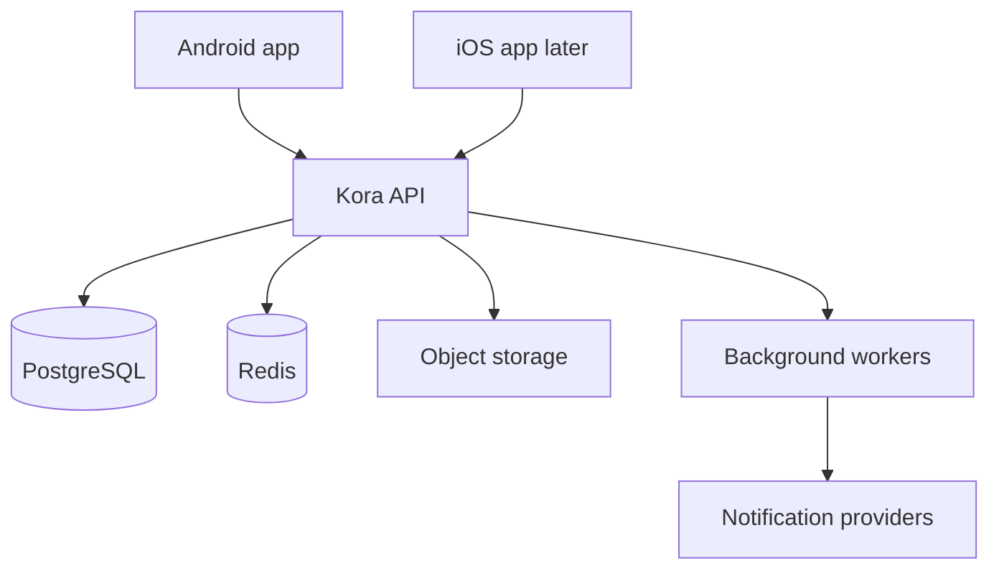
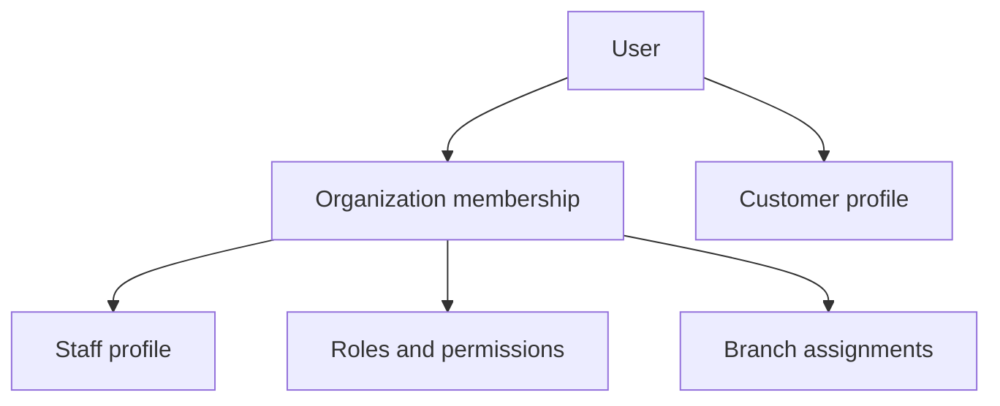
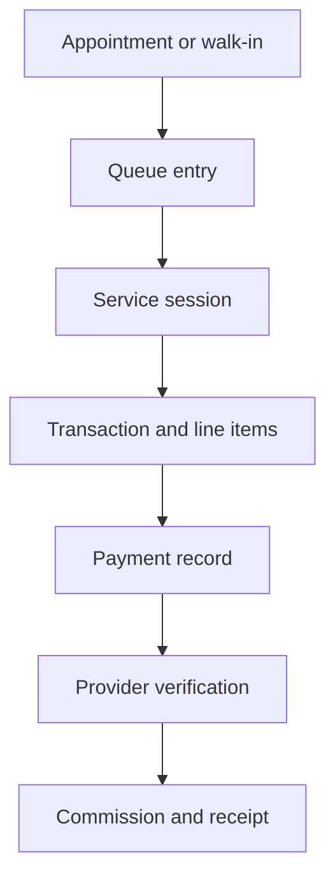
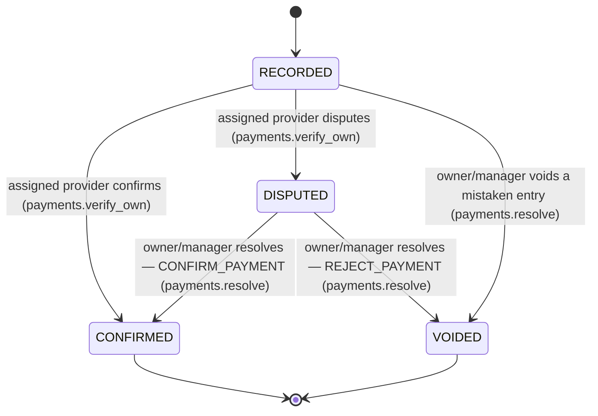

# Kora OS Architecture

Status: Foundation baseline

## 1. Architecture goals

Kora OS must support a single shop with a few employees and grow into a multi-branch service-business platform without replacing its core. The architecture prioritizes financial correctness, tenant isolation, auditability, unreliable-network resilience, clear module boundaries, and mobile usability.

## 2. System context



The Android application is the first production client. iOS will consume the same API and contracts. PostgreSQL is the authoritative store. Room becomes the Android cache and offline queue, not the authoritative source of business or financial truth.

## 3. Repository direction

```text
apps/
  android/              Existing Kotlin and Jetpack Compose application
  api/                  Kora backend modular monolith
  ios/                  Future iOS application
packages/
  contracts/            Generated API schemas and fixtures where useful
docs/                   Product and engineering specifications
infra/                  Deployment definitions added when hosting is selected
```

The existing Google Play `applicationId` remains unchanged so production releases can update the current listing. Internal source namespaces may use the Kora domain naming.

## 4. Mobile architecture

The Android application uses four explicit layers:

### Presentation

- Jetpack Compose screens and reusable design-system components.
- ViewModels expose immutable screen state and accept user intents.
- Composables contain rendering and interaction wiring, not business rules.

### Domain

- Use cases for appointments, queue transitions, service sessions, checkout, verification, and subscriptions.
- Platform-independent business types where practical.
- State-transition validation shared conceptually with the backend, while the backend remains authoritative.

### Data

- Repositories coordinate remote APIs, Room cache, and synchronization.
- API data-transfer objects are mapped into domain models.
- Local entities are not exposed directly to UI code.

### Infrastructure

- HTTP client, secure token storage, database, connectivity, push notifications, telemetry, and background synchronization.

Future shared Kotlin Multiplatform modules may contain domain types, validation helpers, networking contracts, and synchronization rules. The iOS UI decision remains independent until the shared boundary is proven.

## 5. Backend architecture

The backend begins as a modular monolith. It is one deployable service with strong internal boundaries, not a collection of premature microservices.

Initial modules:

- Identity and sessions
- Organizations and memberships
- Branches
- Roles, permissions, and access policy
- Subscriptions and entitlements
- Staff profiles and invitations
- Services and availability
- Customers
- Appointments
- Walk-ins and queue
- Service sessions
- Checkout and transactions
- Payments and verification
- Commissions
- Receipts
- Reconciliation
- Notifications
- Reporting
- Audit

Each module owns its application services and persistence access. Modules communicate through typed application interfaces and domain events rather than reaching into one another's tables from controllers.

## 6. Backend layers

### Transport

- Versioned REST endpoints under `/v1`.
- Authentication, request IDs, validation, rate limits, and consistent errors.
- Controllers translate HTTP requests and do not contain core business logic.

### Application

- Commands and queries implement use cases.
- Authorization is evaluated before protected operations.
- Database transactions define consistency boundaries.
- Idempotency is enforced for replay-sensitive commands.

### Domain

- Entities, value objects, state machines, policy rules, and domain events.
- Financial rules do not import HTTP, database, or notification libraries.

### Infrastructure

- PostgreSQL persistence, Redis coordination, job processing, object storage, delivery providers, and observability adapters.

### Service catalogue, availability, and booking

An organization's bookable `Service` catalogue is grouped by `ServiceCategory` and enabled per branch through `BranchService`, which may override a service's price, duration, or customer-bookability at that one branch — the effective price and duration a customer sees is always server-computed from `Service` plus any `BranchService` override, never client-supplied. `StaffServiceAssignment` connects an eligible, actively branch-assigned staff member to a service at a branch, optionally with its own duration override.

`BranchBusinessHours` (recurring weekly) and `BranchScheduleException` (specific-date closures or special hours, which always win) define when a branch is open; `StaffAvailabilityRule` and `StaffAvailabilityException` define the same for one staff member — deliberately separate tables, because a provider is only bookable where both intersect. `BranchBookingPolicy` centralizes the remaining policy knobs (slot interval, minimum lead time, maximum horizon, buffers before/after, cancellation cutoff, whether a customer may pick a specific provider or only "any available") per branch, with safe hardcoded defaults when a branch has not configured one explicitly.

`AvailabilityEngineService` deterministically combines all of the above — plus already-CONFIRMED appointments — into concrete bookable UTC slots for a requested service (or sequential services), branch, date range, and optional specific provider. Its output is advisory only: nothing about calling it reserves anything, and the actual booking command below revalidates from current state rather than trusting a prior availability read.

Booking (`AppointmentBookingService`) is where a slot becomes a real, durable reservation. Two independent mechanisms make that safe under concurrency:

- **Double-booking prevention is enforced by the database**, not only by the availability screen: a PostgreSQL `EXCLUDE` constraint (`appointments_no_staff_double_booking`, requiring the `btree_gist` extension) on the assigned staff member and the *occupied* UTC time range (service time plus buffers) rejects a genuinely overlapping insert or update outright, so two concurrent requests for the same staff member's same time can never both succeed — whichever transaction commits second gets a database-level conflict, translated into a generic `409 SLOT_UNAVAILABLE`, never a raw constraint error.
- **Idempotency** (`AppointmentIdempotencyKey`, scoped to the authenticated customer and a client-generated key) makes a retried or duplicated booking request return the original appointment instead of creating a second one; reusing a key with a different request is rejected as a conflict.

An appointment's services are stored as `AppointmentItem` snapshots (name, duration, price, currency at booking time) — editing or archiving a `Service` afterward never rewrites a past appointment's record. `Appointment` is not a `ServiceSession`, a `Payment`, or a `Transaction`; a `CONFIRMED` appointment is a reservation, never itself proof that work happened or that revenue was earned (docs/SECURITY.md section 30). `CustomerRecord`, the organization-scoped side of a booking's customer, is created (or reused) automatically on a customer's first booking with that organization and is never visible to, or joinable from, another organization.

### Walk-in intake, live queue, and service sessions

Three domain concepts, kept strict:

- `Appointment` — a reservation (above).
- `QueueEntry` — a customer waiting for or receiving service at a branch *today*. `QueueEntry` itself is the durable walk-in record; a `WALK_IN`-sourced entry and an `APPOINTMENT`-sourced one (created by checking a `CONFIRMED` appointment into the branch's queue, which never mutates the appointment itself) share exactly the same lifecycle, so no separate `WalkIn` table exists.
- `ServiceSession` — actual work performed. A `COMPLETED` session is not a `Payment`, `Transaction`, `Receipt`, or `Commission` — none of those exist yet, and `serviceTotalMinor` is the value of performed services, not proof money was received.

`QueueEntry` moves through an explicit state machine (`WAITING`/`CALLED` ↔ each other or → `CANCELLED`/`NO_SHOW`; either → `IN_SERVICE`). `IN_SERVICE` is reachable only by starting a `ServiceSession`, and `COMPLETED` only by completing one — never a direct command, so a queue entry can never be manually marked done. `BranchQueueDay` (one row per organization, branch, and *branch-local* business date — computed from the branch's own timezone, never the API server's) issues ticket numbers and a polling `revision` through a single atomic Postgres `INSERT ... ON CONFLICT DO UPDATE`, giving Android/iOS a safe polling foundation with no WebSocket or realtime vendor in this phase.

Starting a service (`ServiceSessionsService.start`) is one database transaction: claim the `QueueEntry` (an `UPDATE ... WHERE status IN (WAITING, CALLED)` — the same optimistic, re-checked-on-lock-wait pattern the rest of this codebase uses, not a separate `SELECT ... FOR UPDATE`), resolve and validate the provider (active, tenant- and branch-assigned, qualified for every requested service — the same `resolveEligibleProviders` the availability engine and booking use), snapshot items as `ServiceSessionItem` rows, move the queue entry to `IN_SERVICE`, and write history — all or nothing. Two partial PostgreSQL unique indexes (`WHERE status = 'IN_PROGRESS'`, requiring no additional extension) guarantee at most one active session per staff profile and at most one active session per queue entry at the database level, not only by an application check-then-insert; a violation rolls the whole transaction back, leaving the queue entry exactly as it was, and surfaces as a stable `409 STAFF_ALREADY_SERVING` or `409 QUEUE_ENTRY_ALREADY_IN_SERVICE`, never a raw constraint error. Completion is the same shape: freeze the total, complete the queue entry, one transaction. Cancelling an in-progress session requires a reason and a disposition — `RETURN_TO_QUEUE` (releases the provider, the queue entry goes back to `WAITING`) or `CANCEL_VISIT` (the queue entry is cancelled too) — decided by the acting staff member, never inferred.

A provider may act on their own session (`service_sessions.perform`) but not another provider's without the broader `service_sessions.manage` permission — checked in the service layer, since NestJS's declarative permission guard only expresses "all of these required," not "either of these, then check ownership."

Every transition also appends a `ServiceSessionStatusHistory` row, inside the same transaction as the status-change update — the session's own typed, append-only lifecycle ledger, distinct from the platform-wide `AuditEvent` trail (section 16) both are still written to. `service_sessions.start` is a fourth, narrower permission (receptionist, manager, owner) that reaches `start-service` only — it may start service for a queue entry's *already-assigned* provider, but never complete, cancel, or edit the resulting session, and never redirect the work to a different provider without also holding `queue.manage`. Because `start-service` now legitimately accepts three different permissions with three different scopes (`.start`, `.perform`, `.manage`), the route itself is guarded by a new `@RequireAnyPermission` decorator on `TenantAccessGuard` (section 8) — the coarse "holds at least one of these" gate — while `ServiceSessionsService`'s own `assertStartAuthorized` (a pure, unit-tested function) applies the specific rule each permission actually carries once past it.

## 7. Identity and session architecture

`User` is the global Kora identity. `OrganizationMembership` connects a user to a business. `StaffProfile` contains employment information within that organization. `CustomerProfile` is the same user acting as a customer — the customer workspace and the business workspace (docs/PRODUCT_REQUIREMENTS.md section 2) share one identity without either being authoritative over the other.



Kora OS uses passwordless email OTP authentication for customers, owners, managers and staff. Kora does not store or support user passwords. A user signs in by requesting a one-time code by email and submitting it back — the same flow for a first sign-up and every later sign-in. `AuthIdentity` maps a user to a provider (`EMAIL_OTP` today; `GOOGLE`, `APPLE`, `PHONE_OTP`, and `EMAIL_MAGIC_LINK` are reserved for later) without ever holding a persisted password credential — an OTP challenge is short-lived and lives in its own table, not on the identity or the user. Access tokens are short-lived and carry no role or permission claims. Refresh credentials rotate on every use, are revocable per device, and reusing an already-rotated one revokes the whole session. Mobile secrets use operating-system secure storage. OTP codes are stored only as a keyed digest and never appear in logs.

## 8. Tenant isolation and authorization

Every tenant-owned record carries `organizationId`. The active organization is derived from authenticated membership and explicit request context, never trusted from an arbitrary request body alone.

Authorization evaluates:

1. Authenticated user.
2. Active organization membership.
3. Membership status.
4. Subscription access mode and entitlement where relevant.
5. Required permission — every named code (`@RequirePermissions`, AND semantics).
6. Any-of permission — at least one named code (`@RequireAnyPermission`, OR semantics), for a route more than one permission legitimately reaches with different downstream scope (e.g. `ServiceSessionsController`'s `start-service`).
7. Branch scope.
8. Resource ownership and current state.

Database queries include organization scope. Unique constraints that represent business uniqueness include `organizationId` when appropriate. Automated tests attempt cross-tenant reads and mutations for every sensitive module.

## 9. Subscription and entitlement architecture

Subscriptions belong to organizations. A plan supplies entitlements; the subscription supplies lifecycle state and billing period.

Core concepts:

- Plan
- Plan price
- Entitlement definition
- Plan entitlement
- Organization subscription
- Subscription event
- Billing customer reference
- Usage counter

The API derives an effective access mode:

- `FULL`: trialing, active, or permitted grace period.
- `LIMITED`: past due with selected administrative actions available.
- `READ_ONLY`: operational data remains viewable but new commercial activity is blocked.
- `BLOCKED`: only account recovery, billing, export, and support actions remain.

Provider-specific IDs and payloads stay in the billing adapter. Webhooks are signature-verified, idempotent, stored for reconciliation, and translated into internal subscription events.

## 10. Operational lifecycle

`Appointment`, `QueueEntry`, `ServiceSession`, `Transaction`, and `Payment` are separate aggregates with explicit links.



The transaction stores captured line-item descriptions and prices so historical receipts remain stable after catalog edits.

## 11. Financial consistency

Implemented (docs/ROADMAP.md Phase 6): four distinct entities, each proving a different fact, deliberately never collapsed into one:

- **Checkout** — the amount due for one completed ServiceSession. Immutable snapshots (`CheckoutLineItem`) of what was actually performed, never a live join back to the current Service catalogue.
- **PaymentRecord** — a staff member's *claim* that money was received against a Checkout. Recording one is not itself revenue.
- **PaymentDispute** / `PaymentVerificationEvent` — the assigned provider's confirm-or-dispute step every claim must pass, and an owner/manager's resolution of a dispute.
- **Transaction** — the immutable, posted commercial fact. The only thing a future reporting phase may ever count as business revenue. Created exactly once per Checkout, only when confirmed `PaymentRecord` applied amounts exactly equal the Checkout total, atomically inside the same database transaction that confirms or resolves the final required payment.

Money is stored as integer minor units plus a 3-letter ISO currency code throughout, with explicit overflow validation against PostgreSQL's 32-bit `Int` column ceiling (never floating point). Checkout creation and payment recording both accept a client-generated `Idempotency-Key`, scoped by organization, membership, operation, and idempotency key, storing the request fingerprint and the resulting resource; reusing a key with a different request body is rejected (`IDEMPOTENCY_CONFLICT`), and replaying the same key/body returns the original result rather than a duplicate. Every payment-domain mutation (record, confirm, dispute, void, resolve) takes a `SELECT ... FOR UPDATE` row lock on the parent Checkout as its first database action, in the same order every time — this single lock is what serializes every concurrent mutation against one Checkout and is what makes "exactly one Transaction is ever posted per Checkout, even under concurrent confirmations" true, without any additional locking primitive. Financial transitions execute inside database transactions; a failed transition leaves every row — Checkout, PaymentRecord, Transaction, and their line items/allocations — exactly as it was before the attempt.

Refunds, reversals, commissions, receipts, and reconciliation are explicitly deferred to a later phase (docs/ROADMAP.md Phase 7) and do not exist yet — a Checkout may currently only be voided (before settlement) or posted as a Transaction (after settlement), never reversed once posted.

## 12. Verification state machine

Implemented as `PaymentRecordStatus` (RECORDED → CONFIRMED | DISPUTED; DISPUTED → CONFIRMED | VOIDED via resolution; CONFIRMED and VOIDED are terminal):



Every accepted transition writes an append-only `PaymentVerificationEvent` (previous status, new status, actor, reason where applicable) and an `AuditEvent`, both inside the same database transaction as the state change itself. Separation of duties is enforced in code, not only by permission: a recorder who is also the assigned provider cannot confirm their own claim (`PAYMENT_SELF_CONFIRMATION_FORBIDDEN`) — the one exception is a solo owner/provider, who may confirm via `payments.resolve` as an explicitly reasoned, separately audited (`payment.management_override`) management override, since no independent third party exists to confirm on their behalf. Commission finalization (a future phase) is intended to require a confirmed outcome, mirroring this same principle.

## 13. Events and background work

Business state and an outbox event are written in the same database transaction. A worker publishes unprocessed outbox events to notification, reporting, receipt, and realtime handlers.

Important events include:

- AppointmentCreated
- CustomerCheckedIn
- ServiceStarted
- ServiceCompleted
- PaymentRecorded
- PaymentConfirmationRequested
- PaymentConfirmed
- PaymentDisputed
- DisputeResolved
- CommissionFinalized
- ReceiptIssued
- SubscriptionStateChanged

Handlers are idempotent. A failed notification does not roll back a valid financial transaction.

## 14. Offline and synchronization architecture

The Android app may cache services, customers, appointments, queue state, and authorized summaries. Locally created commands carry a stable command ID, organization, branch, device, local timestamp, schema version, and sync status.

Sync statuses are:

- Pending
- Sending
- Synchronized
- Failed retryable
- Rejected
- Conflict

Financial offline commands are introduced only after their duplicate, conflict, authorization, and recovery behavior is tested. The app never converts an uncertain network result into a second payment attempt with a new idempotency key.

## 15. Notifications and realtime updates

Business modules publish internal events. Notification policies decide recipients and channels. Channel adapters deliver push, in-app, SMS, WhatsApp, or email.

Realtime updates improve dashboards and queues but are not the source of truth. After reconnecting, clients refresh authoritative API data using version or cursor information.

## 16. Audit and observability

Audit events are append-only from application code and separate from diagnostic logs. They include organization, optional branch, actor, action, entity, request ID, timestamp, safe before/after metadata, and source device where known.

Operational telemetry includes structured logs, metrics, traces, job status, notification delivery status, request IDs, and error monitoring. Logs redact tokens, OTP codes, payment credentials, and sensitive customer content — Kora has no passwords to redact, since it does not store or support them.

## 17. Security boundaries

- The mobile app never contains backend, billing, or payment-provider secrets.
- TLS protects all production traffic.
- Input validation occurs at transport and domain boundaries.
- Rate limits protect authentication, invitations, booking, and financial routes.
- Database backups are encrypted and restoration is tested.
- Administrative support access is explicit, time-bounded, and audited.

## 18. Deployment direction

Initial production deployment consists of:

- One stateless API service with multiple instances when needed.
- One worker process using the same application modules.
- Managed PostgreSQL with backups and point-in-time recovery.
- Managed Redis for bounded caching, jobs, and coordination.
- S3-compatible object storage for receipts and future attachments.
- Separate development, staging, and production environments.

## 19. Architectural decisions

- Use a modular monolith before microservices.
- Keep PostgreSQL as the source of truth and Room as a client cache.
- Use organization-scoped RBAC with branch constraints.
- Keep subscriptions provider-neutral and server-enforced.
- Keep appointments, service sessions, transactions, and payments separate.
- Use minor currency units and idempotent financial commands.
- Use transactional outbox events for reliable side effects.
- Generate mobile API models from versioned contracts where practical.
- Introduce Kotlin Multiplatform sharing incrementally instead of rewriting the working Android UI immediately.

## 20. Architecture guardrails

- No business logic in Composables or HTTP controllers.
- No direct database access across module boundaries without an owned interface.
- No tenant-owned query without organization scope.
- No financial state transition without authorization, idempotency, database transaction, and audit evidence.
- No notification-provider calls inside core transaction logic.
- No production feature considered complete while backed only by local demonstration data.
- No unrestricted database access for AI/business-intelligence features (post-V1 extensions, docs/ROADMAP.md section 17): any future AI layer consumes the same controlled, authorized discovery and availability APIs a client would, never a direct query path.
