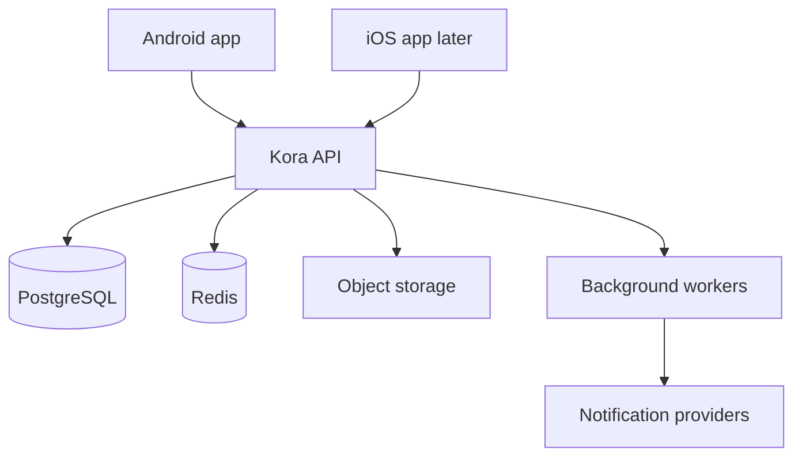
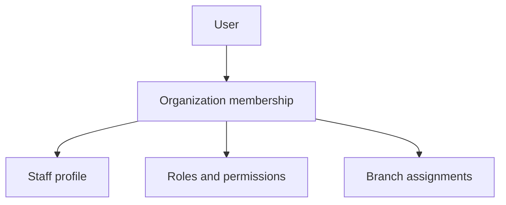
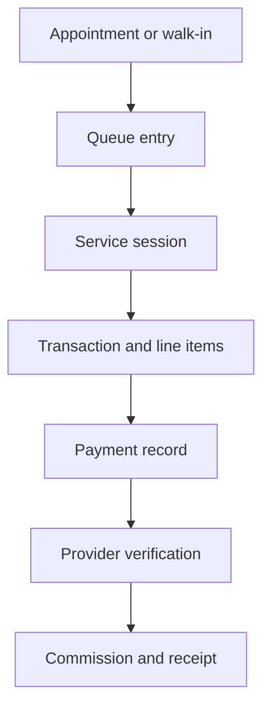
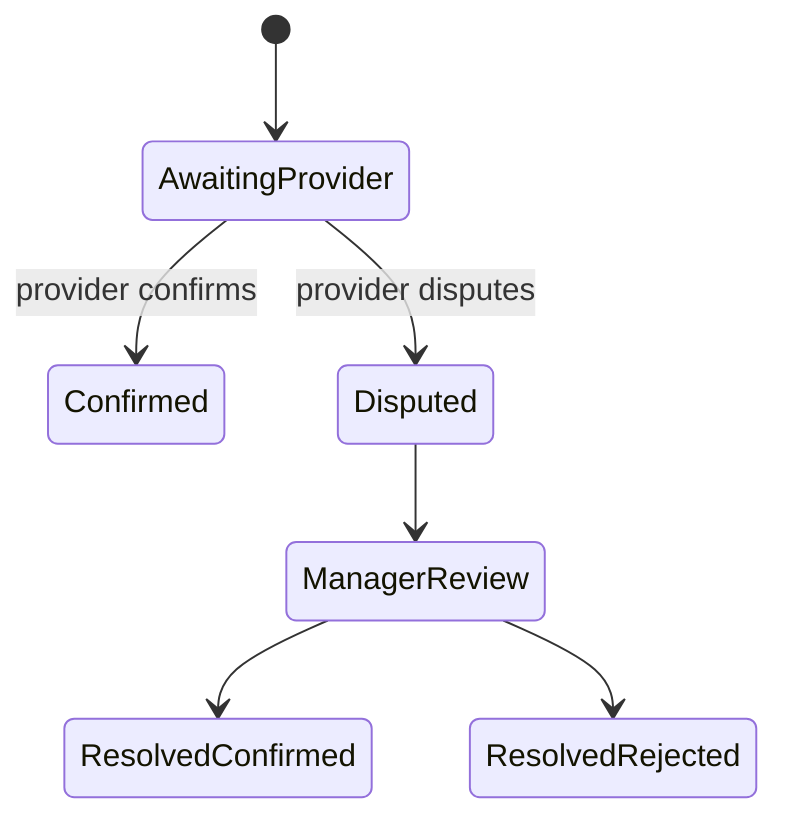

# Kora OS Architecture

Status: Foundation baseline

## 1. Architecture goals

Kora OS must support a single shop with a few employees and grow into a multi-branch service-business platform without replacing its core. The architecture prioritizes financial correctness, tenant isolation, auditability, unreliable-network resilience, clear module boundaries, and mobile usability.

## 2. System context



The Android application is the first production client. iOS will consume the same API and contracts. PostgreSQL is the authoritative store. Room becomes the Android cache and offline queue, not the authoritative source of business or financial truth.

## 3. Repository direction

```text
apps/
  android/              Existing Kotlin and Jetpack Compose application
  api/                  Kora backend modular monolith
  ios/                  Future iOS application
packages/
  contracts/            Generated API schemas and fixtures where useful
docs/                   Product and engineering specifications
infra/                  Deployment definitions added when hosting is selected
```

The existing Google Play `applicationId` remains unchanged so production releases can update the current listing. Internal source namespaces may use the Kora domain naming.

## 4. Mobile architecture

The Android application uses four explicit layers:

### Presentation

- Jetpack Compose screens and reusable design-system components.
- ViewModels expose immutable screen state and accept user intents.
- Composables contain rendering and interaction wiring, not business rules.

### Domain

- Use cases for appointments, queue transitions, service sessions, checkout, verification, and subscriptions.
- Platform-independent business types where practical.
- State-transition validation shared conceptually with the backend, while the backend remains authoritative.

### Data

- Repositories coordinate remote APIs, Room cache, and synchronization.
- API data-transfer objects are mapped into domain models.
- Local entities are not exposed directly to UI code.

### Infrastructure

- HTTP client, secure token storage, database, connectivity, push notifications, telemetry, and background synchronization.

Future shared Kotlin Multiplatform modules may contain domain types, validation helpers, networking contracts, and synchronization rules. The iOS UI decision remains independent until the shared boundary is proven.

## 5. Backend architecture

The backend begins as a modular monolith. It is one deployable service with strong internal boundaries, not a collection of premature microservices.

Initial modules:

- Identity and sessions
- Organizations and memberships
- Branches
- Roles, permissions, and access policy
- Subscriptions and entitlements
- Staff profiles and invitations
- Services and availability
- Customers
- Appointments
- Walk-ins and queue
- Service sessions
- Checkout and transactions
- Payments and verification
- Commissions
- Receipts
- Reconciliation
- Notifications
- Reporting
- Audit

Each module owns its application services and persistence access. Modules communicate through typed application interfaces and domain events rather than reaching into one another's tables from controllers.

## 6. Backend layers

### Transport

- Versioned REST endpoints under `/v1`.
- Authentication, request IDs, validation, rate limits, and consistent errors.
- Controllers translate HTTP requests and do not contain core business logic.

### Application

- Commands and queries implement use cases.
- Authorization is evaluated before protected operations.
- Database transactions define consistency boundaries.
- Idempotency is enforced for replay-sensitive commands.

### Domain

- Entities, value objects, state machines, policy rules, and domain events.
- Financial rules do not import HTTP, database, or notification libraries.

### Infrastructure

- PostgreSQL persistence, Redis coordination, job processing, object storage, delivery providers, and observability adapters.

## 7. Identity and session architecture

`User` is the global Kora identity. `OrganizationMembership` connects a user to a business. `StaffProfile` contains employment information within that organization.



Access tokens are short-lived. Refresh credentials rotate and are revocable per device. Mobile secrets use operating-system secure storage. Passwords, if managed by Kora, use a modern password hashing function and never appear in logs.

## 8. Tenant isolation and authorization

Every tenant-owned record carries `organizationId`. The active organization is derived from authenticated membership and explicit request context, never trusted from an arbitrary request body alone.

Authorization evaluates:

1. Authenticated user.
2. Active organization membership.
3. Membership status.
4. Subscription access mode and entitlement where relevant.
5. Required permission.
6. Branch scope.
7. Resource ownership and current state.

Database queries include organization scope. Unique constraints that represent business uniqueness include `organizationId` when appropriate. Automated tests attempt cross-tenant reads and mutations for every sensitive module.

## 9. Subscription and entitlement architecture

Subscriptions belong to organizations. A plan supplies entitlements; the subscription supplies lifecycle state and billing period.

Core concepts:

- Plan
- Plan price
- Entitlement definition
- Plan entitlement
- Organization subscription
- Subscription event
- Billing customer reference
- Usage counter

The API derives an effective access mode:

- `FULL`: trialing, active, or permitted grace period.
- `LIMITED`: past due with selected administrative actions available.
- `READ_ONLY`: operational data remains viewable but new commercial activity is blocked.
- `BLOCKED`: only account recovery, billing, export, and support actions remain.

Provider-specific IDs and payloads stay in the billing adapter. Webhooks are signature-verified, idempotent, stored for reconciliation, and translated into internal subscription events.

## 10. Operational lifecycle

`Appointment`, `QueueEntry`, `ServiceSession`, `Transaction`, and `Payment` are separate aggregates with explicit links.



The transaction stores captured line-item descriptions and prices so historical receipts remain stable after catalog edits.

## 11. Financial consistency

- Money is stored as integer minor units plus ISO currency code.
- Payment, refund, and commission records are not represented by floating-point values.
- Every replay-sensitive command accepts a client-generated idempotency key.
- The server stores the key, request fingerprint, result, and expiration policy.
- Reusing a key with a different request is rejected.
- Financial transitions execute inside database transactions.
- Confirmed financial facts are corrected through explicit reversals or adjustment records.

Payment, verification, transaction, refund, and commission statuses are separate. One status field never attempts to represent the complete financial lifecycle.

## 12. Verification state machine



Every accepted transition records actor, time, reason where required, previous state, new state, and audit event. Commission is finalized only after a confirmed outcome.

## 13. Events and background work

Business state and an outbox event are written in the same database transaction. A worker publishes unprocessed outbox events to notification, reporting, receipt, and realtime handlers.

Important events include:

- AppointmentCreated
- CustomerCheckedIn
- ServiceStarted
- ServiceCompleted
- PaymentRecorded
- PaymentConfirmationRequested
- PaymentConfirmed
- PaymentDisputed
- DisputeResolved
- CommissionFinalized
- ReceiptIssued
- SubscriptionStateChanged

Handlers are idempotent. A failed notification does not roll back a valid financial transaction.

## 14. Offline and synchronization architecture

The Android app may cache services, customers, appointments, queue state, and authorized summaries. Locally created commands carry a stable command ID, organization, branch, device, local timestamp, schema version, and sync status.

Sync statuses are:

- Pending
- Sending
- Synchronized
- Failed retryable
- Rejected
- Conflict

Financial offline commands are introduced only after their duplicate, conflict, authorization, and recovery behavior is tested. The app never converts an uncertain network result into a second payment attempt with a new idempotency key.

## 15. Notifications and realtime updates

Business modules publish internal events. Notification policies decide recipients and channels. Channel adapters deliver push, in-app, SMS, WhatsApp, or email.

Realtime updates improve dashboards and queues but are not the source of truth. After reconnecting, clients refresh authoritative API data using version or cursor information.

## 16. Audit and observability

Audit events are append-only from application code and separate from diagnostic logs. They include organization, optional branch, actor, action, entity, request ID, timestamp, safe before/after metadata, and source device where known.

Operational telemetry includes structured logs, metrics, traces, job status, notification delivery status, request IDs, and error monitoring. Logs redact tokens, passwords, payment credentials, and sensitive customer content.

## 17. Security boundaries

- The mobile app never contains backend, billing, or payment-provider secrets.
- TLS protects all production traffic.
- Input validation occurs at transport and domain boundaries.
- Rate limits protect authentication, invitations, booking, and financial routes.
- Database backups are encrypted and restoration is tested.
- Administrative support access is explicit, time-bounded, and audited.

## 18. Deployment direction

Initial production deployment consists of:

- One stateless API service with multiple instances when needed.
- One worker process using the same application modules.
- Managed PostgreSQL with backups and point-in-time recovery.
- Managed Redis for bounded caching, jobs, and coordination.
- S3-compatible object storage for receipts and future attachments.
- Separate development, staging, and production environments.

## 19. Architectural decisions

- Use a modular monolith before microservices.
- Keep PostgreSQL as the source of truth and Room as a client cache.
- Use organization-scoped RBAC with branch constraints.
- Keep subscriptions provider-neutral and server-enforced.
- Keep appointments, service sessions, transactions, and payments separate.
- Use minor currency units and idempotent financial commands.
- Use transactional outbox events for reliable side effects.
- Generate mobile API models from versioned contracts where practical.
- Introduce Kotlin Multiplatform sharing incrementally instead of rewriting the working Android UI immediately.

## 20. Architecture guardrails

- No business logic in Composables or HTTP controllers.
- No direct database access across module boundaries without an owned interface.
- No tenant-owned query without organization scope.
- No financial state transition without authorization, idempotency, database transaction, and audit evidence.
- No notification-provider calls inside core transaction logic.
- No production feature considered complete while backed only by local demonstration data.
